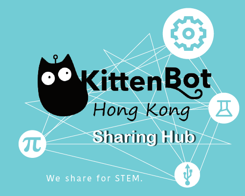

# 歡迎來到Kittenbot HK Sharing Hub

<figure><figcaption></figcaption></figure>

歡迎來到Kittenbot HK的Coding & STEM Sharing Hub，這裡可以找到Kittenbot 的編程與STEM產品學習資訊﹑使用秘訣﹑應用分享及購買方法等… 讓”貓粉”能夠集中在這裏找到最新的”貓訊”


[kits](kits/)



[futureboard](futureboard/)



[jacdac](jacdac/)



[koi](koi/)



[meowbit](meowbit/)



[expansion\_board](expansion\_board/)



[functional\_modules](functional\_modules/)



[wifibrick\_iot](wifibrick\_iot/)



[actuators](actuators/)



[nanobit](nanobit/)



[microcode.md](microcode.md)



[kittenblock](kittenblock/)



[kittencode](kittencode/)



[makecode](makecode/)



[studio.md](studio.md)



[microbitv2.md](microbitv2.md)

