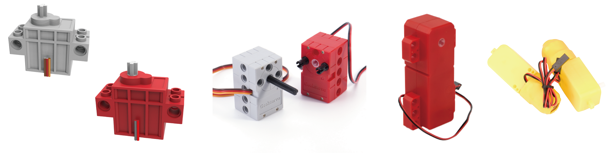

# 各款電機與舵機

<figure><figcaption></figcaption></figure>

Kittenbot各款電機與舵機的資料。


[geekservo9g\_motor.md](geekservo9g\_motor.md)



[geekservo9g\_servo.md](geekservo9g\_servo.md)



[geekservo2k\_motor.md](geekservo2k\_motor.md)



[geekservo2k\_servo.md](geekservo2k\_servo.md)



[ttmotor.md](ttmotor.md)



[360servo.md](360servo.md)



[130motor.md](130motor.md)



[9g.md](9g.md)

