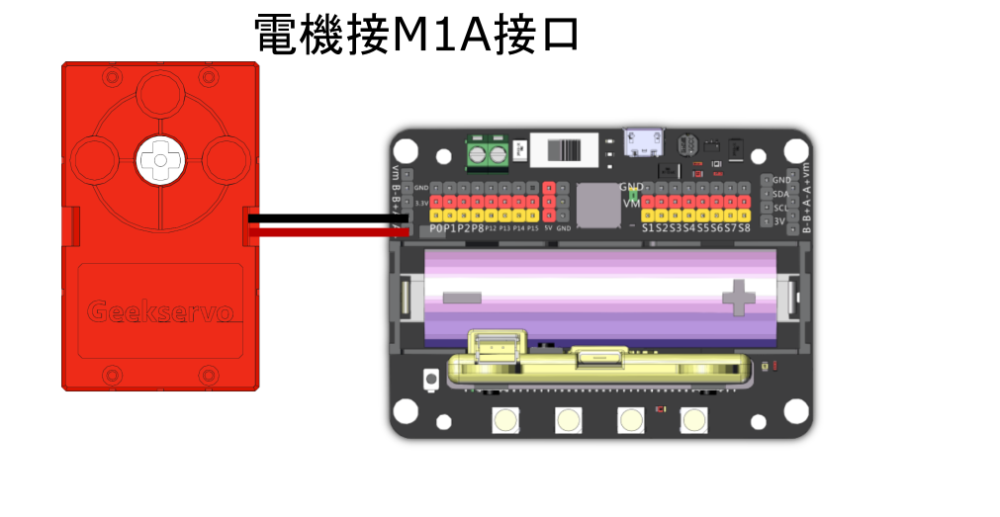
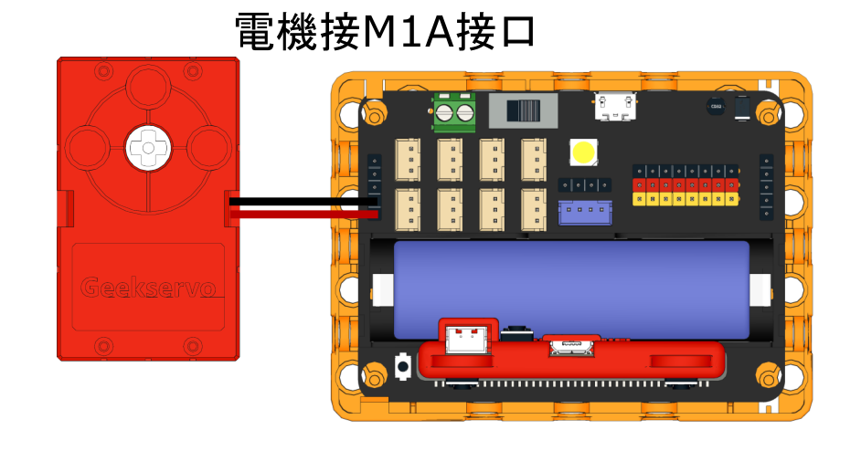
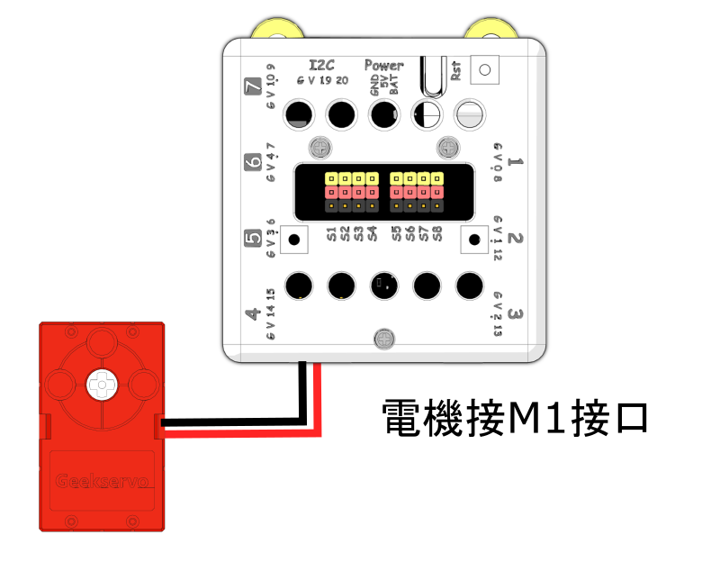

# GeekServo 2KG電機

這是一款兼容樂高插孔的高扭力的電機，相對於9g電機，在同等供電下具有更高轉速。輸出軸為兩組樂高十字孔，主要用在驅動動力機械。

### 產品參數

* 工作電壓：3.3V\~6V
* 額定電壓：4.8V
* 額定電流：70mA
* 堵轉電流：900mA
* 打滑電流：700mA
* 最大扭力：1.6kg±0.2kg/cm(4.8V)
* 最高轉速：120rpm(3V供電情况下)
* 重量：20g
* 接口：紅黑線

### 產品特色：

繼承了GeekServo 9G舵機電機的優點，增強了扭力與速度，改善了結構

* 採用十字沉孔作輸出軸
  * 可以因使用情況自由插入不同長度的十字軸
* 扭力更大
  * 扭力為GeekMotor 9G的三倍左右

### 規格尺寸

#### 樂高孔單位:

* 長度：5孔
* 闊度：3孔
* 高度：3孔
* 輸出軸：樂高十字軸

#### mm單位:

* 長度：40mm
* 闊度：24mm
* 高度：24mm
* 輸出軸：樂高十字軸

## 使用教學

## Robotbit EDU/2.2

### 接線方法

#### Robotbit 2.2

<figure><figcaption></figcaption></figure>

#### Robotbit EDU

<figure><figcaption></figcaption></figure>

### MakeCode編程教學

#### 加載Robotbit插件：

#### 在擴展頁直接搜尋robotbit (robotbit已經過微軟認證，可以直接搜尋)

#### 你亦可以用插件地址搜尋

robotbit插件：https://github.com/KittenBot/pxt-robotbit

#### [詳細方法](../programmingplatforms/makecode/kittenbotandmakecode.md)

#### 馬達積木塊:

<figure><figcaption></figcaption></figure>

#### 參考程式

[https://makecode.microbit.org/\_ADRfV0U4Cbjy](https://makecode.microbit.org/_ADRfV0U4Cbjy)



## Armourbit

### 接線方法

<figure><figcaption></figcaption></figure>

### MakeCode編程教學

#### 加載Powerbrick插件：

#### 在擴展頁直接搜尋Powerbrick (powerbrick已經過微軟認證，可以直接搜尋)

#### [詳細方法](../programmingplatforms/makecode/kittenbotandmakecode.md)

#### 參考程式



## Meowbit

### 接線方法

#### Robotbit 2.2

<figure><figcaption></figcaption></figure>

#### Robotbit EDU

<figure><figcaption></figcaption></figure>

### MakeCode Arcade編程教學

#### 加載robotbit插件：https://github.com/KittenBot/meow-robotbit

#### [詳細方法](../programmingplatforms/makecode/kittenbotandmakecode.md)

#### 電機積木塊:

<figure><figcaption></figcaption></figure>

#### 參考程式

[https://makecode.com/\_drW0kX41L02f](https://makecode.com/_drW0kX41L02f)



## 插件版本與更新

插件可能會不定時推出更新，改進功能。亦有時候我們可能需要轉用舊版插件才可使用某些功能。

詳情請參考: [Makecode插件版本更換](../programmingplatforms/makecode/makecodeextupdate.md)
