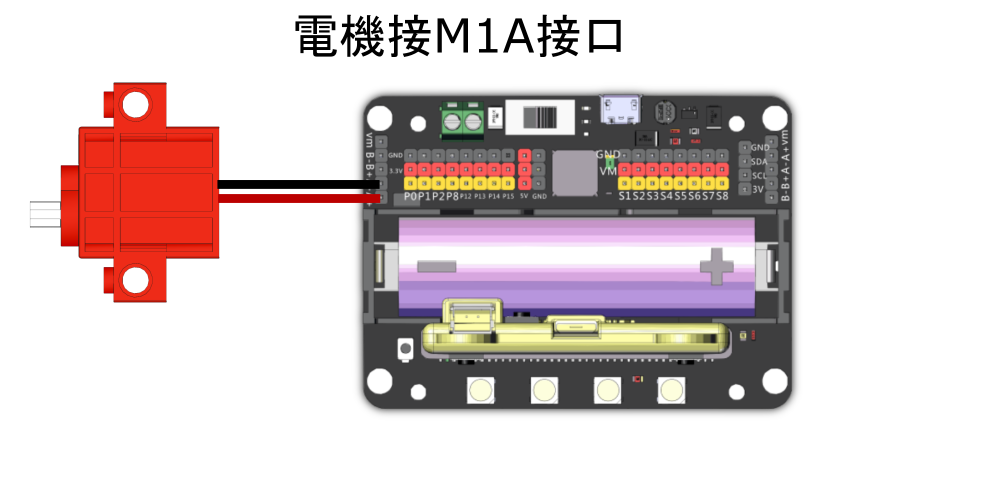
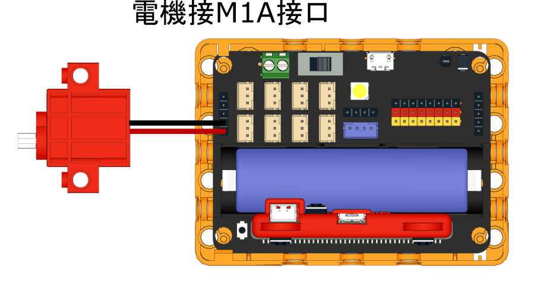

# Geekservo 9g電機

這是一款兼容樂高件的減速直流電機，輸出軸為樂高十字軸。主要用作驅動如車子，齒輪般動力機械。

### 產品參數

* 工作電壓：3.3V\~6V
* 額定電壓：4.8V
* 額定電流：200ma
* 堵轉電流：700ma
* 打滑電流：450ma
* 最大扭力：500g/cm(4.8V)
* 最高轉速：70rpm(3V供電情况下)
* 重量：12.4g
* 接口：紅黑線

### 使用注意事項

* 這只是一種小型電機，使用情境的扭力和電壓需求請不要過大。
* Geekservo電機沒有線序要求，調換線序只影響轉動方向。
* 禁止長時間超出堵轉電流，否則會燒壞電機。

### 規格尺寸

#### 樂高孔單位:

* 長度：5孔
* 闊度：2孔
* 高度：3孔
* 輸出軸：樂高十字軸

#### mm單位:

* 長度：40mm
* 闊度：16mm
* 高度：34.4mm
* 輸出軸：樂高十字軸

### Geekservo特色

* 極力子過載保護:
  * 遇到輸出軸被暴力扭擰會啟動極力子進行跳齒保護，發出「噠噠噠」的聲音。不會損毀齒輪。
* 安裝方式靈活:
  * 支援樂高標準磚和Technic插孔，輸出軸亦是樂高標準十字軸。
* 輕盈小巧:
  * 方便製作各種小型機械。

## 使用教學

## Robotbit EDU/2.2

### 接線方法

#### Robotbit 2.2

<figure><figcaption></figcaption></figure>

#### Robotbit EDU

<figure><figcaption></figcaption></figure>

### MakeCode編程教學

#### 加載Robotbit插件：

#### 在擴展頁直接搜尋robotbit (robotbit已經過微軟認證，可以直接搜尋)

#### 你亦可以用插件地址搜尋

robotbit插件：https://github.com/KittenBot/pxt-robotbit

#### [詳細方法](../../programmingplatforms/makecode/kittenbotandmakecode.md)

#### 馬達積木塊:

<figure><figcaption></figcaption></figure>

#### 參考程式



[https://makecode.microbit.org/\_ADRfV0U4Cbjy](https://makecode.microbit.org/_ADRfV0U4Cbjy)
