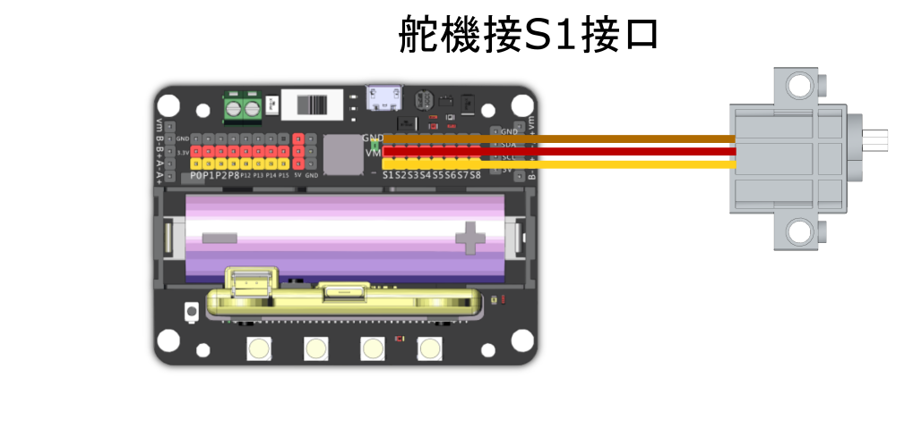
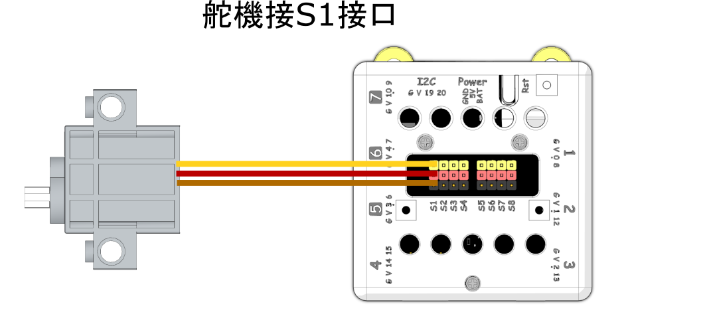

# Geekservo 9g舵機

這是一款兼容樂高件的舵機。輸出軸為樂高十字軸。主要用在需求精細控制的結構上，例如關節，機械臂。

### 產品參數

* 工作電壓：3.3V\~6V
* 額定電壓：4.8V
* 額定電流：200ma
* 堵轉電流：700ma
* 打滑電流：450ma
* 最大扭力：500g/cm(4.8V)
* 角度轉速：60°/0.12s
* 角度範圍：-45°\~225°
* 重量：12.4g
* 接口：橙紅啡線

### 使用注意事項

* 這只是一種小型電機，使用情境的扭力和電壓需求請不要過大。
* Geekservo舵機有嚴格的線序要求，請根據線序連接。
* 禁止長時間超出堵轉電流，否則會燒壞電機。

### 規格尺寸

#### 樂高孔單位:

* 長度：5孔
* 闊度：2孔
* 高度：3孔
* 輸出軸：樂高十字軸

#### mm單位:

* 長度：40mm
* 闊度：16mm
* 高度：34.4mm
* 輸出軸：樂高十字軸

### Geekservo特色

* 極力子過載保護:
  * 遇到輸出軸被暴力扭擰會啟動極力子進行跳齒保護，發出「噠噠噠」的聲音。不會損毀齒輪。
* 安裝方式靈活:
  * 支援樂高標準磚和Technic插孔，輸出軸亦是樂高標準十字軸。
* 輕盈小巧:
  * 方便製作各種小型機械。

## 使用教學

## Robotbit EDU/2.2

### 接線方法

#### Robotbit 2.2

<figure><figcaption></figcaption></figure>

#### Robotbit EDU

<figure><figcaption></figcaption></figure>

### MakeCode編程教學

#### 加載Robotbit插件：

#### 在擴展頁直接搜尋robotbit (robotbit已經過微軟認證，可以直接搜尋)

#### 你亦可以用插件地址搜尋

robotbit插件：https://github.com/KittenBot/pxt-robotbit

#### [詳細方法](../../programmingplatforms/makecode/kittenbotandmakecode.md)

#### 舵機積木塊:

<figure><figcaption></figcaption></figure>

#### 參考程式

[https://makecode.microbit.org/\_4LaMLJEbz91X](https://makecode.microbit.org/_4LaMLJEbz91X)



## Armourbit

### 接線方法

<figure><figcaption></figcaption></figure>

#### 參考程式

[https://makecode.microbit.org/\_YfJdx4FRx2eP](https://makecode.microbit.org/_YfJdx4FRx2eP)



## Meowbit

### 接線方法

#### Robotbit 2.2

<figure><figcaption></figcaption></figure>

#### Robotbit EDU

<figure><figcaption></figcaption></figure>

### MakeCode Arcade編程教學

#### 加載robotbit插件：https://github.com/KittenBot/meow-robotbit

#### [詳細方法](../../programmingplatforms/makecode/kittenbotandmakecode.md)

#### 舵機積木塊

<figure><figcaption></figcaption></figure>

#### 參考程式

[https://makecode.com/\_WrrEcRhMm0o4](https://makecode.com/_WrrEcRhMm0o4)



### 插件版本與更新

插件可能會不定時推出更新，改進功能。亦有時候我們可能需要轉用舊版插件才可使用某些功能。

詳情請參考: [Makecode插件版本更換](../../programmingplatforms/makecode/makecodeextupdate.md)
