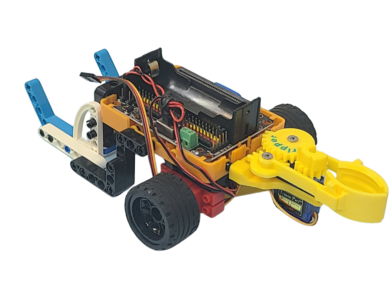

# 機械爪

<figure><figcaption></figcaption></figure>

這是一隻以9g小舵機控制的機械爪，機械爪可以輕易夾取乒乓波等物件，機械爪配有積木結構洞，可以輕易結合各種應用場合。

### 產品參數

* 工作電壓：3.3V\~6V
* 額定電壓：4.8V
* 最大扭力：1.6kg±0.2kg/cm(4.8V)
* 角度範圍：0°\~180°
* 重量：9g
* 接口：橙紅啡線

### 產品展示

<div><figure><figcaption></figcaption></figure> <figure><figcaption></figcaption></figure></div>

<div><figure><figcaption></figcaption></figure> <figure><figcaption></figcaption></figure></div>

<div><figure><figcaption></figcaption></figure> <figure><figcaption></figcaption></figure></div>

#### 與Robotbit結合示範

<figure><figcaption></figcaption></figure>

### 接線方法

將舵機的橙紅啡線連接至RobotBit的舵機接口。


```
啡色接負極，紅色接正極，橙色接數據
```

### MakeCode編程教學



### 抓力調節

假如想增加抓力，可以將橡皮圈繫在機械爪上，提升機械爪與物件的摩擦力。

<figure><figcaption></figcaption></figure>

