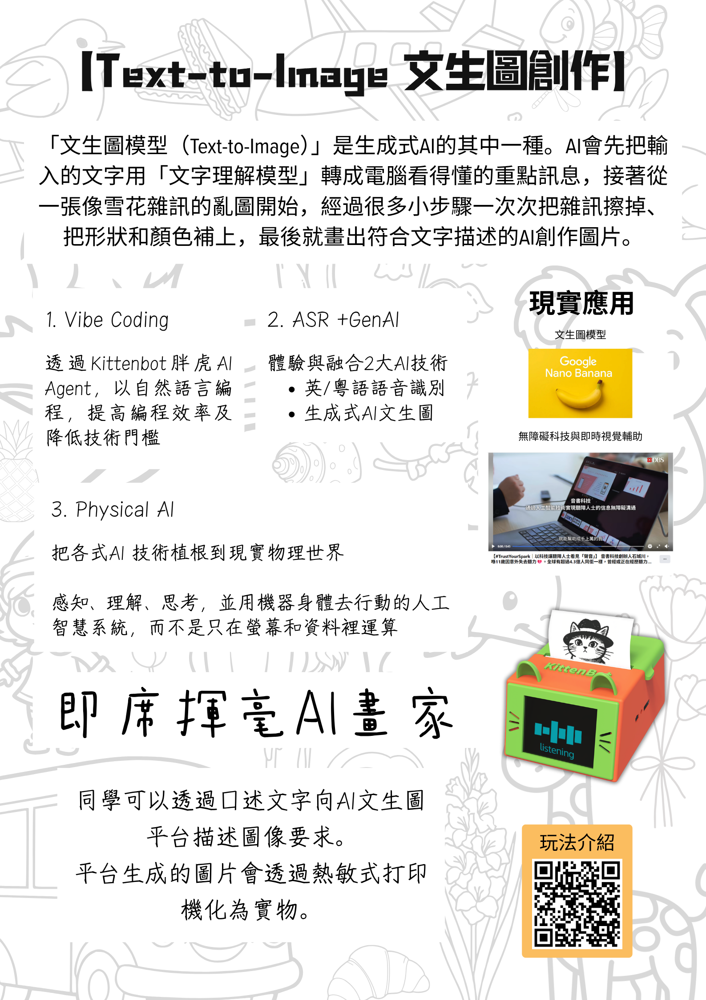

# 【STEAM Day & 開放日必備】智啟學教 智能互動專區

<figure><figcaption></figcaption></figure>

### 打造學校智能教學新亮點！

迎接 AI 教育新時代，如何讓學生在好玩、互動的環境中真正理解人工智能？KittenBot 特別推出「智」啟學教智能互動專區 (AI Corner)，專為學校 STEAM Day、科學周及校園開放日而設。

本專區結合了 5 大沉浸式 AI 體驗，打破傳統課堂的沉悶，讓學生透過動手操作與實時互動，輕鬆解碼 AI 背後的科技原理！

### 精選套件內容包括：

* Micro:bit AI 魔杖套件 x 2 套
* KOI AI 氣墊球 x 2 套
* AI 多元鑑別器 x 2 套
* AI Printer x 2 件

讓 AI 技術看得見、摸得著、玩得到！立即為校園引入最具吸引力的 AI 互動專區，展現學校創新科技教育的成果！

## 5大沉浸式AI體驗 打造學校智能教學新亮點

### 1. 機器視覺

#### KOI AI 氣墊球：

透過與 KOI AI 進行刺激的氣墊球競技，讓學生親身體驗機器視覺與追蹤的強大原理，瞬間激發學習 AI 的興趣。


[aihockey.md](../kits/aihockey.md)


<figure><figcaption></figcaption></figure>

### 2. 機器學習特徵提取

#### Micro:bit AI 魔杖套件：

結合 Jacdac 模組與 Micro:bit CreateAI 平台，讓學生親手訓練 AI 辨識手勢，體驗揮動魔杖施展「魔法」的科技魅力。


[aimagicwand](../kits/aimagicwand/)


<figure><figcaption></figcaption></figure>

### 3. 圖像辨識 及 4. 生成式AI

#### AI 多元鑑別器：

完美結合本地 KOI 圖像識別與雲端生成式 AI，將科技融入人文學科活動，開拓跨學科學習的新維度。


[ai\_agentdevice](../kits/ai_agentdevice/)


<figure><figcaption></figcaption></figure>

### 5. AI文生圖

#### AI Printer：

動口不動手！學生只需透過口述文字向 AI 文生圖平台描述圖像要求，系統便會即時生成並打印出獨一無二的 AI 圖片。


[aiprinter.md](../kits/aiprinter.md)


<figure><figcaption></figcaption></figure>
