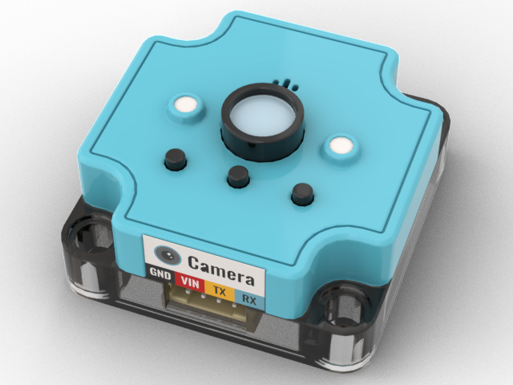

# AI 功能模組

<figure><figcaption>
KOI 人工智能鏡頭
</figcaption></figure>

 

<figure><figcaption>
Sugar ASR 語音模組
</figcaption></figure>

 

<figure><figcaption>
Sugar Cam 鏡頭模組
</figcaption></figure>


[koi2](koi2/)



[koi](koi/)



[asr](asr/)



[teachablemachine](../functional\_modules/sugar/sugarcam/teachablemachine/)

