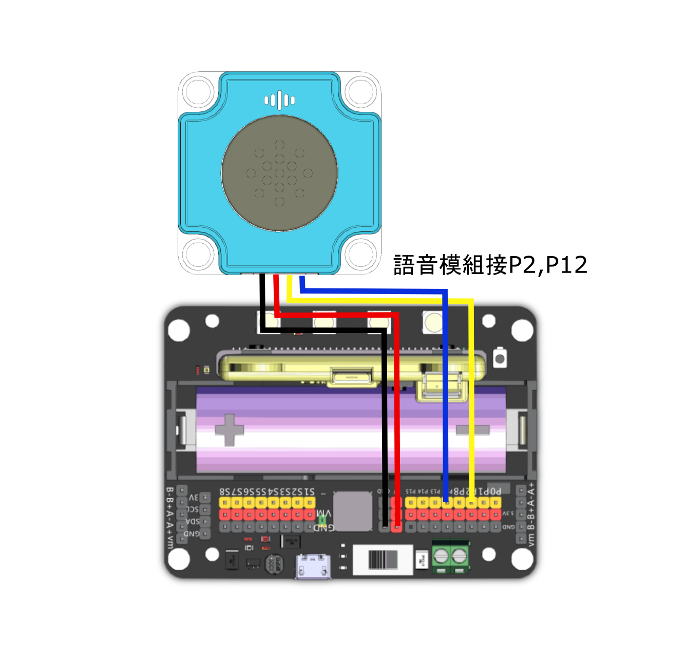
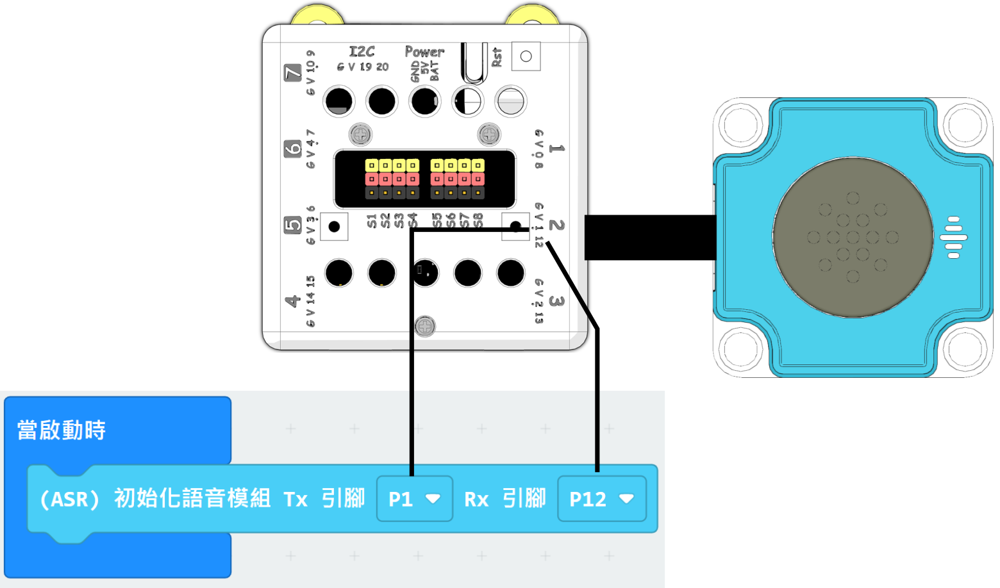

# 語音模組 編程教學

ASR語音模組可以配合MakeCode或KittenBlock編程使用。

### 接線教學

### Robotbit EDU


### Robotbit 2.2

<figure><figcaption></figcaption></figure>

### Armourbit


編程時請注意要選擇正確引腳。


<figure><figcaption></figcaption></figure>

### 編程教學

### Microbit MakeCode編程教學


#### 加載Sugar插件：

#### 在擴展頁直接搜尋sugar (sugar已經過微軟認證，可以直接搜尋)


#### 你亦可以用插件地址搜尋

Sugar插件：https://github.com/KittenBot/pxt-sugar

#### [詳細方法](../../programmingplatforms/makecode/kittenbotandmakecode.md)

#### Sugar語音模組積木


#### 語音辨識參考程式



[參考程式下載](https://makecode.microbit.org/\_RCWckUH0bcXe)

```
  注意：2個語音播報指令之間需要加等待，等待上一個語音播報完成，否則語音播報會重疊。
```

參考程式用法：

#### 操作教學

#### 1. 開電後模組會讀出固件版本，完成之後就可以開始使用。

#### 2. 使用時需要先使用喚醒指令喚醒語音模組。模組喚醒會回答Uh Huh。

喚醒指令有3種：

1. Hey Sugar
2. Hello KittenBot
3. Hello Kitty

#### 3. 對語音模組說出Lamp On或Lamp Off，辨識命令詞後語音模組會回答OK，Micro:bit上的LED就會亮起相應的燈。

#### 4. 模組閒置10秒之後會進入睡眠模式，進入睡眠模式之後需要再次喚醒才可使用。

#### 5. 按下A鍵或B鍵，語音模組就會說出相應指令。

#### 示範短片



### 未來板KittenBlock編程教學


#### 語音辨識參考程式


參考程式用法：

#### 1. 開電後模組會讀出固件版本，完成之後就可以開始使用。

#### 2. 使用時需要先使用喚醒指令喚醒語音模組。模組喚醒會回答Uh Huh。

喚醒指令有3種：

1. Hey Sugar
2. Hello KittenBot
3. Hello Kitty

#### 3. 對語音模組說出Lamp On或Lamp Off，辨識命令詞後語音模組會回答OK，Micro:bit上的LED就會亮起相應的燈。

#### 4. 模組閒置10秒之後會進入睡眠模式，進入睡眠模式之後需要再次喚醒才可使用。

#### 語音播報參考程式


參考程式用法:

#### 1. 按下A鍵或B鍵，語音模組就會說出相應指令。
