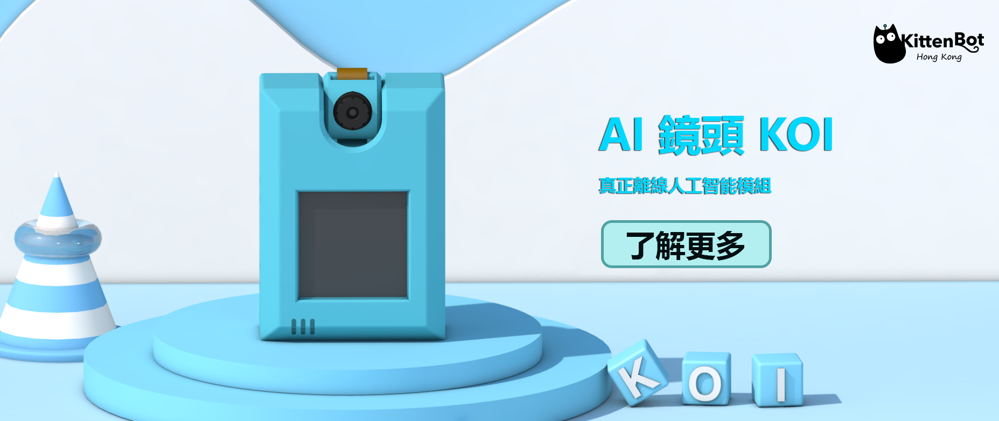

---
layout:
  title:
    visible: true
  description:
    visible: true
  tableOfContents:
    visible: true
  outline:
    visible: true
  pagination:
    visible: true
---

# AI鏡頭KOI

<figure><figcaption></figcaption></figure>

這裡集合了KOI AI鏡頭的各種資料，包括KOI硬件介紹，編程教學和更新教學。


[intro.md](intro.md)



[makecode](makecode/)



[futureboard\_demo](futureboard\_demo/)



[command.md](command.md)



[kittenblock\_micropython](kittenblock\_micropython/)



[update](update/)

