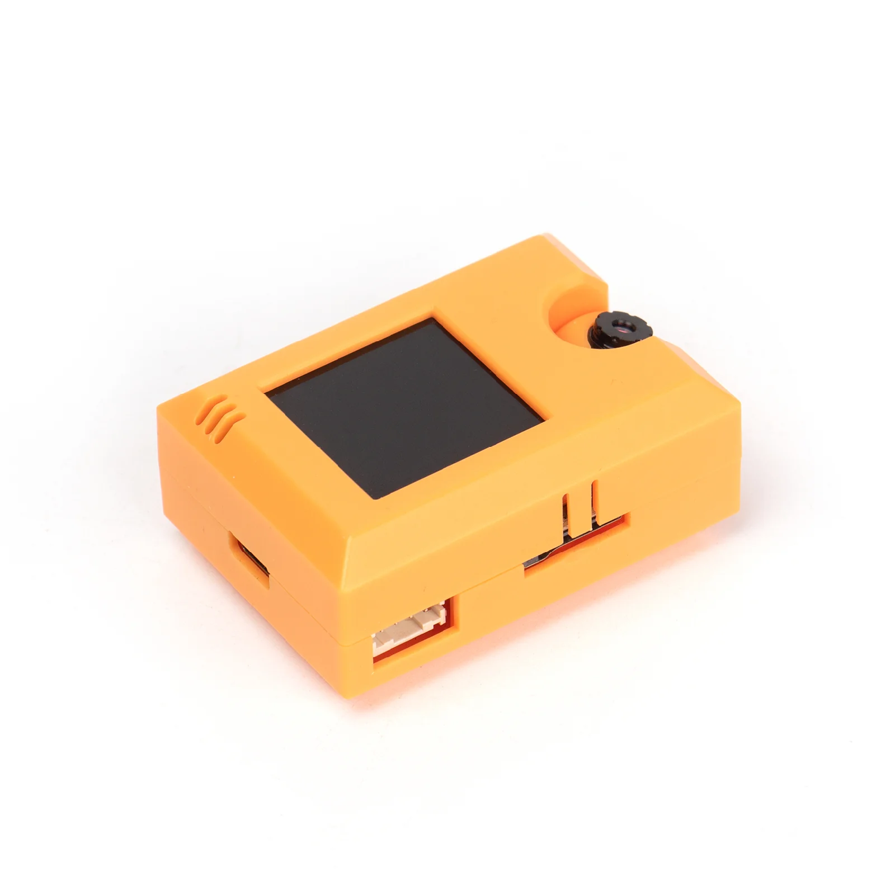

# KOI 2介紹

<figure><figcaption></figcaption></figure>

Kittenbot 於2024年第二季推出了KOI 2 AI 人工智能鏡頭, 以更簡易, 更穏定的性能去配合教育的需求。

KOI 2在部份功能上作出了優化，更它更適合作為課室中**AI教育**的配置。

KOI 2是小喵科技針對中小學和愛好者開發一款可圖形化程式設計的離線人工智慧模組，機身配有:

<mark style="color:orange;">**鏡頭、麥克風、喇叭、IPS屏模、WIFI**</mark>模組等等…… 可實現多種視覺識別及物聯網等功能。

KOI 2內建 WIFI功能，可讓你的人工智慧作品接入雲端，<mark style="color:orange;">**連接各大IOT平台**</mark>, 作品更可多樣化。

齊備的功能可以讓你系統性地體驗與學習人工智慧!

· **使用人群：** 中小學教學 / 愛好者 / 已熟悉Makecode 或 Kittenblock人工智慧的進階用戶

<figure><figcaption></figcaption></figure>

 

<figure><figcaption></figcaption></figure>

 

<figure><figcaption></figcaption></figure>

### <mark style="color:orange;">新KOI主要功能提升一覽</mark>

1. 圖像辨識
   * 模型<mark style="color:orange;">**訓練**</mark>：40張照片<mark style="color:orange;">**樣本上限放寬**</mark>，樣本數目上限提升 (上限測試中, 暫時150個樣本能通過)
   * 圖像分類：除了獲得分類結果外，新增獲得<mark style="color:orange;">**相似值**</mark>的功能
   * 模型儲存：毋須使用SD卡，模型可以直接儲存到KOI的內存裡面
2. 人面檢測
   * 口罩偵測：內置模型,  可以偵測畫面中人面有沒有佩戴口罩
   * 人面屬性：內置模型, 可以偵測畫面中人面的屬性，包括性別／眼鏡及表情
3. <mark style="color:orange;">**預載**</mark>物件<mark style="color:orange;">**追蹤模型**</mark>
   * 新增預載模型，讓用家毋須訓練已經可以用到以下<mark style="color:orange;">**追蹤**</mark>功能
     * 數字卡(提供PDF下載)、路牌卡模型(提供PDF下載)、3色球模型
4. <mark style="color:orange;">**預載**</mark>20種常見物件物件<mark style="color:orange;">**辨認模型**</mark>。
5. 加強<mark style="color:orange;">**線條追蹤**</mark>
   * 線條追蹤更快更準確

### KOI 2 功能提升 示範短片



### KOI 與 KOI 2功能對照表

<figure><figcaption></figcaption></figure>

### KOI 2產品參數

<figure><figcaption></figcaption></figure>

· 處理器：K210

· 支持的主控：Microbit、未來板、Arduino系列及任何帶有串口功能的主控板

· 顯示幕：1.3寸 240x240 IPS屏

· 攝像頭：640x480 RGB

· 音訊輸入/輸出：單聲道48k取樣速率輸出，8k取樣速率麥克風輸入

· SD卡槽：可插入TF卡，用於儲存AI模型和影音資源

· 無線通訊：WIFI基於ESP32

· 資料輸出方式：UART / USB

· 輸入按鍵：2個，可程式設計

· 記憶體卡支援：16 G

· 供電電壓：5v

· 可支援的程式設計環境：

1. Kittenblock
2. Makecode
3. Micropython
4. [ObjectBlocks](https://www.objectblocks.cc/)

### KOI 與 KOI 2 外觀分別

1. 外殼顏色&#x20;

&#x20;        KOI 1: 粉藍色 ; KOI2: 橙色

2. 外接 / 電源接口

&#x20;        KOI: micro USB  ; KOI 2 : Type C。

兩者在其餘外觀結構上沒有明顯的分別。

<figure><figcaption></figcaption></figure>
