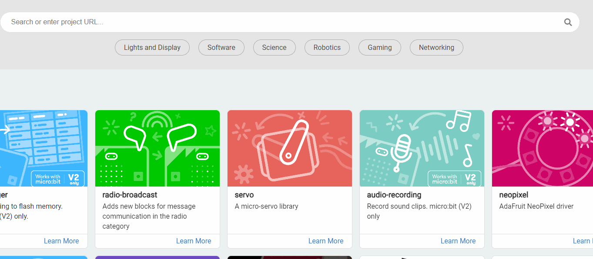

# 人面屬性檢測

### MakeCode編程

在MakeCode打開專案，點擊擴展一頁。

<figure><figcaption></figcaption></figure>

在搜尋欄輸入koi 2。

<figure><figcaption></figcaption></figure>

加載成功後，積木欄會新增koi2的積木。

<figure><figcaption></figcaption></figure>

### 編程積木

<figure><figcaption></figcaption></figure>

### 參考程式


Armourbit用家請使用初始化Armourbit積木。


<figure><figcaption></figcaption></figure>



[參考程式](https://makecode.microbit.org/_bRJ7KJPiRFPy)

#### 程式解說

1. KOI會自動檢測人面，假如人面正在微笑，Micro:bit會顯示笑臉圖案。
