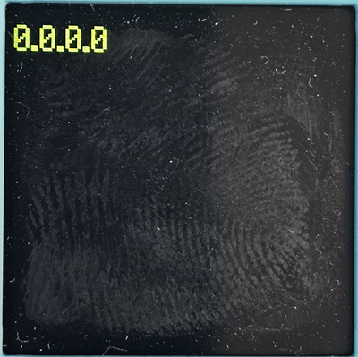
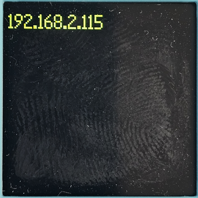
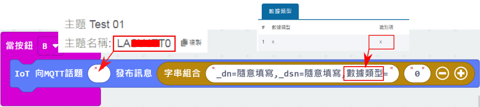

# IoT物聯網

### WiFi須知

### 注意！KOI 2只能連接2.4GHz的網絡，請確保WiFi熱點支援2.4GHz的網絡。

### MakeCode編程

在MakeCode打開專案，點擊擴展一頁。

<figure><figcaption></figcaption></figure>

在搜尋欄輸入koi 2。

<figure><figcaption></figcaption></figure>

加載成功後，積木欄會新增koi2的積木。

<figure><figcaption></figcaption></figure>

### 編程積木

<figure><figcaption></figcaption></figure>

### 參考程式

### 連接WiFi網絡


KOI 2需要使用2.4GHz的WiFi網絡，請注意。



Armourbit用家請使用初始化Armourbit積木。


<figure><figcaption></figcaption></figure>



[參考程式](https://makecode.microbit.org/_cEy78WKd6XVR)

#### 程式解說

1. 按A鍵連接WiFi。
2. 按B鍵顯示KOI的IP地址。


在連接MQTT平台之前，請確保KOI 2能夠成功連接WiFi網絡並可以獲取IP地址。

假如KOI 2未能成功連線，KOI 2會顯示0.0.0.0。


<figure><figcaption>
未能連接Wifi網絡
</figcaption></figure> <figure><figcaption>
成功連接WiFi網絡
</figcaption></figure>

### 連接MQTT與收發信息


Armourbit用家請使用初始化Armourbit積木。


<figure><figcaption></figcaption></figure>



[參考程式](https://makecode.microbit.org/_CgYhzEgsX22E)

#### 程式解說

1. 按A鍵連接WiFi與MQTT平台。
2. 按B鍵向MQTT平台發送訊息。
3. Micro:bit會顯示MQTT平台收到的訊息。

### MakerCloud創客雲 參考程式



[參考程式](https://makecode.microbit.org/_DovYtzcEhbfk)

發送訊息的積木必須按照以下格式填寫，請將主題名稱填進話題，並且將話題的數據類型識別碼取代數據類型。

<figure><figcaption></figcaption></figure>
