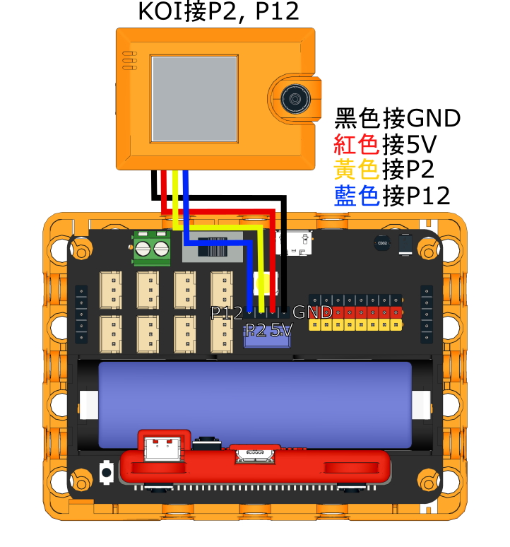
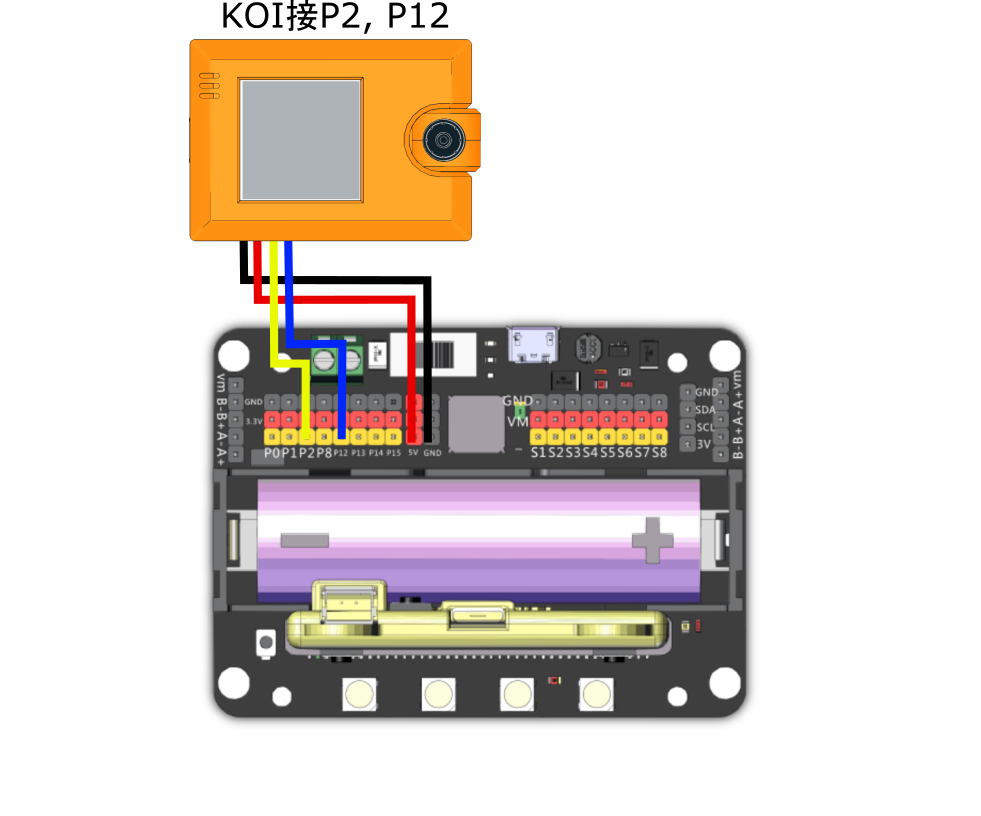

# KOI 2與MakeCode快速入門

## <mark style="color:orange;">**接線方法**</mark>

### **1. 與Robotbit EDU 組合使用**

使用隨盒附送的4pin 線, 白色大插頭插入KOI 中

Robotbit Edu上已經提供了4pin的通訊連供電接口，我們只需要將KOI連接到通訊接口(如下圖)就可以了。

由於Robotbit Edu的通訊接口使用了P2與P12，我們在MakeCode裡面就要相應地選擇引腳。

<mark style="background-color:yellow;">注:  如欲為KOI 2以USB 方式額外供電, 請拔走黑 (GND) 及 紅(5V) 2跟線。</mark>

<figure><figcaption></figcaption></figure>


KOI的RX接口(黃色線)接到Robotbit的TX接口(P2)。

KOI的TX接口(藍色線)接到Robotbit的RX接口(P12)。


<figure><figcaption></figcaption></figure>

### **2. 與Robotbit 2.2  組合使用**

使用隨盒附送的4pin 線, 白色大插頭插入KOI 中

另一端參考下方接線圖

&#x20;           黑 - GND

&#x20;           紅 - 5V

&#x20;           黃 - P2 (TX)

&#x20;           藍 - P12 (RX)

但用家<mark style="background-color:orange;">必須</mark><mark style="background-color:orange;">**注意**</mark>, 在接駁4條杜邦線時, 要格外留意**5V** 及**GND** 的插線,

## <mark style="color:red;">**xxx 切勿反接 xxx**</mark>

否則KOI 2有機會不能再運作了 >.<


```
黃色線只可以接類比引腳（Pin0-2）！使用Pin0的話請拔除蜂鳴器跳線帽。
```

<figure><figcaption></figcaption></figure>

**重要事項: 黑 (GND) 及 紅(5V) 切勿反接!!!**

再&#x6B21;_&#x6AA2;查接線無誤_ 後, 就可以打開Robitbit 的開關, 便會看到KOI 的屏幕顯示鏡頭畫面。

<figure><figcaption></figcaption></figure>

<figure><figcaption></figcaption></figure>

### **3. 使用Armourbit**

接線系統上, Armourbit 相對簡易便捷, 只需把2頭都是白色4芯插頭的接線 (Cable C), 分別接到KOI 2 及Armourbit  (Port 2) 上便可以了。

註: Cable C 並非KOI 2 的標準配套件, 訂購時請註明需求。

<figure><figcaption></figcaption></figure>


Armourbit與KOI配合使用時，KOI必須額外提供5V電。

大家可以從Armourbit的電池盒, 以USB介面進行引出(如下圖)。

<figure><figcaption></figcaption></figure>

<figure><figcaption></figcaption></figure>

然後在程式裡面只需要使用初始化Armourbit的積木然後選擇相應的接口(範例接線為Port2)就可以成功連接KOI 2。

<figure><figcaption></figcaption></figure>

## <mark style="color:orange;">MakeCode插件快速解說</mark>

### 加入MakeCode插件

成功接線後就可以準備編程。

插件地址：[**https://github.com/KittenBot/pxt-koi2**](https://github.com/KittenBot/pxt-koi2)

在MakeCode打開專案，點擊擴展一頁。

<figure><figcaption></figcaption></figure>

在搜尋欄輸入koi 2。

<figure><figcaption></figcaption></figure>

加載成功後，積木欄會新增koi2的積木。

<figure><figcaption></figcaption></figure>

#### &#x20;<mark style="background-color:yellow;">1. 初始化</mark>&#x20;

<figure><figcaption></figcaption></figure>

初始化Micro:Bit與KOI 2的連接, 必須加入每個程式中。

#### &#x20;<mark style="background-color:yellow;">2. 基本積木</mark>&#x20;

<figure><figcaption></figcaption></figure>

KOI 2的基本功能，包括拍照錄音按鍵等。

#### &#x20;<mark style="background-color:yellow;">3. 模式選擇</mark>&#x20;

<figure><figcaption></figcaption></figure>

選擇KOI 2的運行模式，進行任何AI功能之前都必須選擇相應模式 (同時間只能運行1個模式, 可通過按鍵編程轉換模式)。

#### &#x20;<mark style="background-color:yellow;">4. 人面屬性類</mark>&#x20;

<figure><figcaption></figcaption></figure>

#### &#x20;<mark style="background-color:yellow;">5. 人面口罩追蹤</mark>&#x20;

<figure><figcaption></figcaption></figure>

#### &#x20;<mark style="background-color:yellow;">6. 色塊追蹤</mark>&#x20;

<figure><figcaption></figcaption></figure>

#### &#x20;<mark style="background-color:yellow;">7. 線條追蹤</mark>&#x20;

<figure><figcaption></figcaption></figure>

#### &#x20;<mark style="background-color:yellow;">8. 機器學習 圖像辨識</mark>&#x20;

<figure><figcaption></figcaption></figure>

#### &#x20;<mark style="background-color:yellow;">9. 預載模型 路牌追蹤</mark>&#x20;

<figure><figcaption></figcaption></figure>

#### &#x20;<mark style="background-color:yellow;">10. 預載模型 數字追蹤</mark>&#x20;

<figure><figcaption></figcaption></figure>

#### &#x20;<mark style="background-color:yellow;">11. 預載模型 物件追蹤</mark>&#x20;

<figure><figcaption></figcaption></figure>

#### &#x20;<mark style="background-color:yellow;">12. 掃碼類</mark>&#x20;

<figure><figcaption></figcaption></figure>

#### &#x20;<mark style="background-color:yellow;">13. WiFi物聯網類</mark>&#x20;

<figure><figcaption></figcaption></figure>
