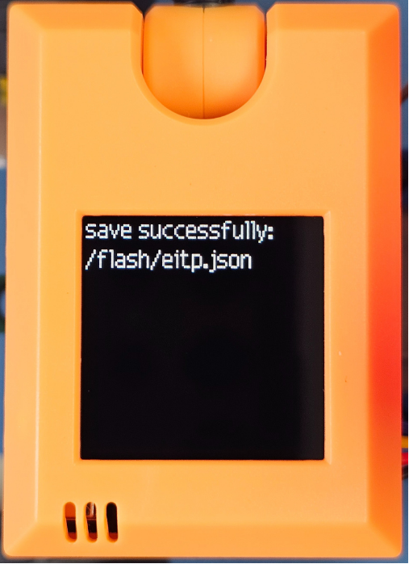

# 機器學習圖像辨識 模型訓練

### MakeCode編程

在MakeCode打開專案，點擊擴展一頁。

<figure><figcaption></figcaption></figure>

在搜尋欄輸入koi 2。

<figure><figcaption></figcaption></figure>

加載成功後，積木欄會新增koi2的積木。

<figure><figcaption></figcaption></figure>

### 編程積木

<figure><figcaption></figcaption></figure>

### 參考程式


KOI 2已經放寬了40張照片的限制

毋須使用SD卡模型儲存，模型可以直接儲存到KOI的內存裡面



Armourbit用家請使用初始化Armourbit積木。


<figure><figcaption></figcaption></figure>



[參考程式](https://makecode.microbit.org/_FKDPvMhKFiLV)

#### 程式解說


訓練時，KOI會顯示該物件的相片數量。

儲存成功的話，KOI會顯示Save Successfully的畫面。


1. 按A訓練第一件物件，並將物件分類為A。
2. 按B訓練第一件物件，並將物件分類為B。
3. 按A+B將模型儲存。模型成功儲存後，KOI會顯示Save Successfully的畫面。

<figure><figcaption></figcaption></figure>

