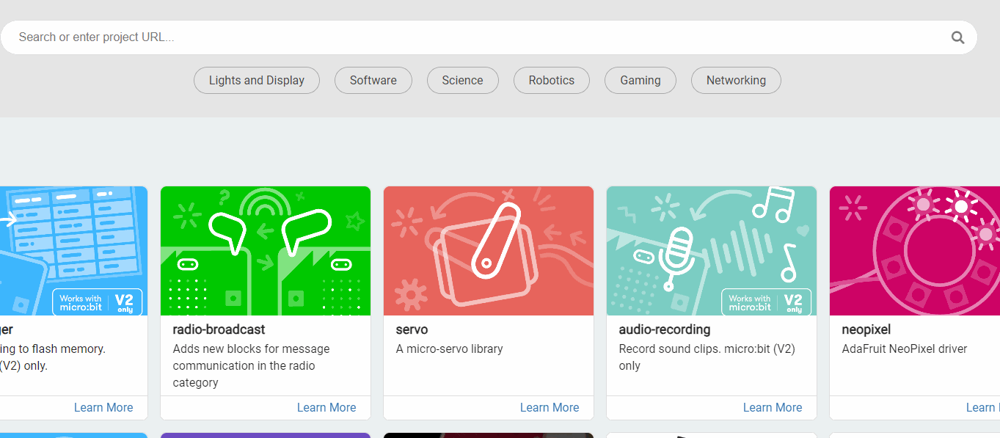

# 錄音與播放

### MakeCode編程教學

在MakeCode打開專案，點擊擴展一頁。

<figure><figcaption></figcaption></figure>

在搜尋欄輸入koi 2。

<figure><figcaption></figcaption></figure>

加載成功後，積木欄會新增koi2的積木。

<figure><figcaption></figcaption></figure>

### 編程積木

<figure><figcaption></figcaption></figure>

### 參考程式


錄音與播放功能需要高速Micro SD卡(class 10或以上)，KOI原廠不配備SD卡，有需要的請自行預備。



Armourbit用家請使用初始化Armourbit積木。


<figure><figcaption></figcaption></figure>



[參考程式](https://makecode.microbit.org/_Ug9RsvXpe8fg)

#### 程式解說

1. 按下B鍵，KOI會進行3秒的錄音並儲存為testing.wav。
2. 按下A鍵，KOI會播放SD卡中名為testing.wav的檔案。
