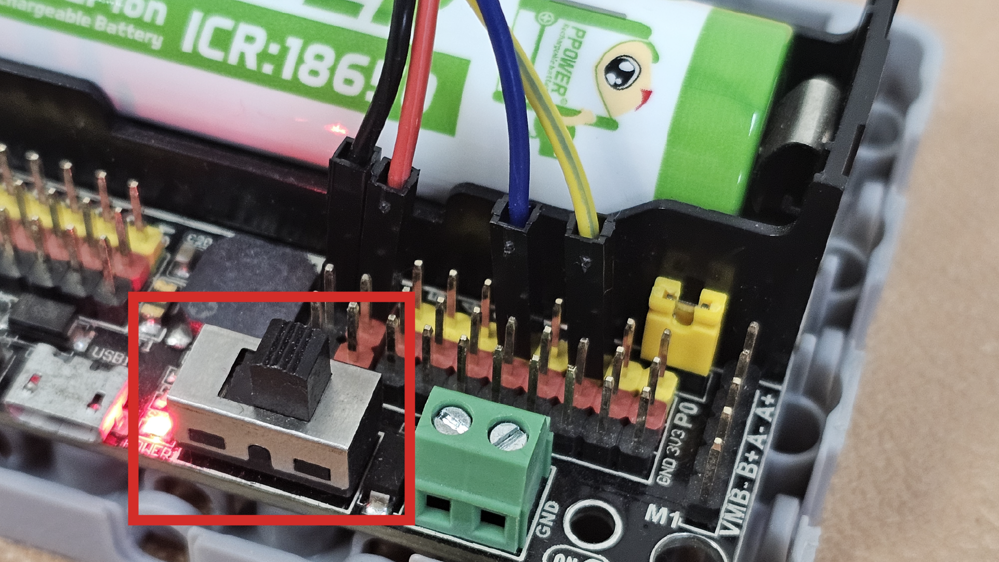
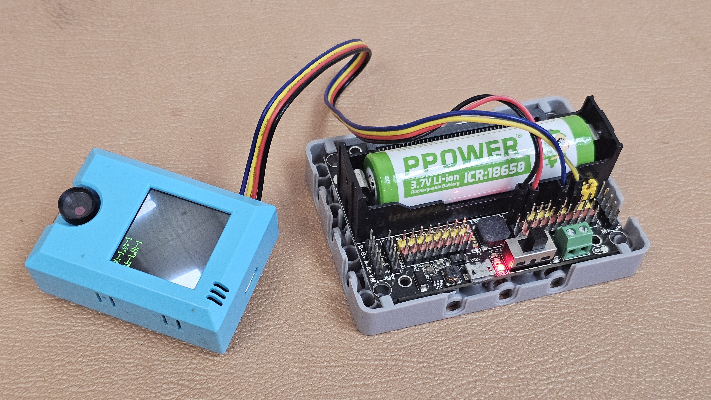

# KOI 2在MicroPython編程快速入門

## <mark style="color:orange;">**接線方法**</mark>

### **1. 與Robotbit EDU 組合使用**

使用隨盒附送的4pin 線, 白色大插頭插入KOI 中

Robotbit Edu上已經提供了4pin的通訊連供電接口，我們只需要將KOI連接到通訊接口(如下圖)就可以了。

由於Robotbit Edu的通訊接口使用了P2與P12，我們在MakeCode裡面就要相應地選擇引腳。

<mark style="background-color:yellow;">注:  如欲為KOI 2以USB 方式額外供電, 請拔走黑 (GND) 及 紅(5V) 2跟線。</mark>

<figure><figcaption></figcaption></figure>


KOI的RX接口(黃色線)接到Robotbit的TX接口(P2)。

KOI的TX接口(藍色線)接到Robotbit的RX接口(P12)。


<figure><figcaption></figcaption></figure>

### **2. 與Robotbit 2.2  組合使用**

使用隨盒附送的4pin 線, 白色大插頭插入KOI 中

另一端參考下方接線圖

&#x20;           黑 - GND

&#x20;           紅 - 5V

&#x20;           黃 - P2 (TX)

&#x20;           藍 - P12 (RX)

但用家<mark style="background-color:orange;">必須</mark><mark style="background-color:orange;">**注意**</mark>, 在接駁4條杜邦線時, 要格外留意**5V** 及**GND** 的插線,

## <mark style="color:red;">**xxx 切勿反接 xxx**</mark>

否則KOI 2有機會不能再運作了 >.<


```
黃色線只可以接類比引腳（Pin0-2）！使用Pin0的話請拔除蜂鳴器跳線帽。
```

<figure><figcaption></figcaption></figure>

**重要事項: 黑 (GND) 及 紅(5V) 切勿反接!!!**

再&#x6B21;_&#x6AA2;查接線無誤_ 後, 就可以打開Robitbit 的開關, 便會看到KOI 的屏幕顯示鏡頭畫面。

<figure><figcaption></figcaption></figure>

<figure><figcaption></figcaption></figure>

### MicroPython編程快速開始

Open KittenCode in browser.



建立新專案。(未來板/未來板Lite)

<figure><figcaption></figcaption></figure>

將未來板連接到KittenCode。

<div><figure><figcaption></figcaption></figure> <figure><figcaption></figcaption></figure> <figure><figcaption></figcaption></figure></div>

按運行程式就可以在線運行程式或按上傳程式將程式上傳到未來板。

<figure><figcaption></figcaption></figure>
