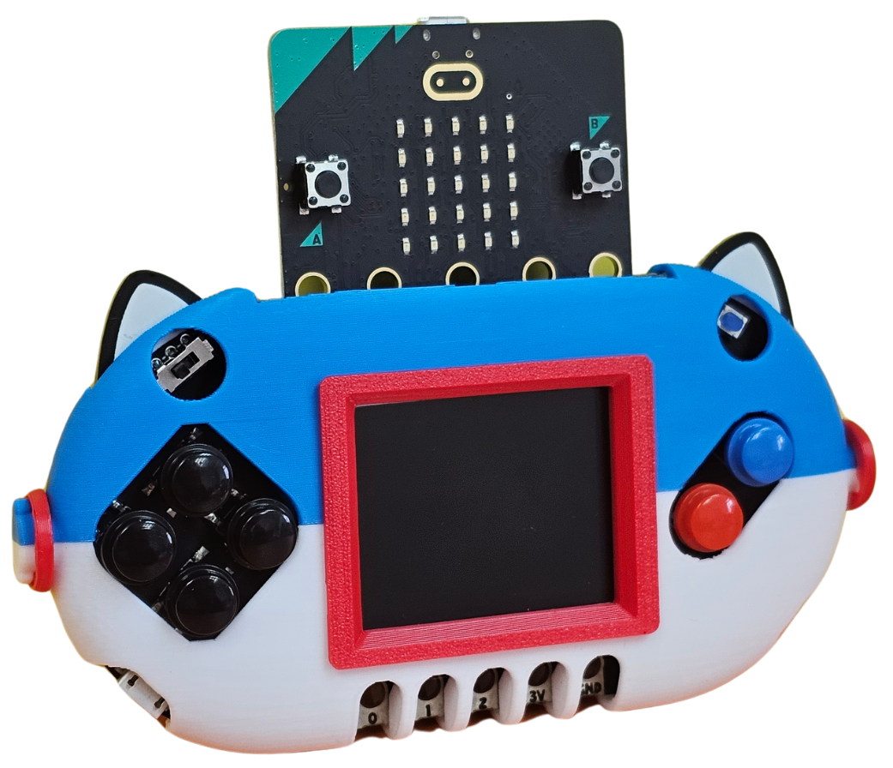

# Newbit Arcade Shield擴展板

<figure><figcaption></figcaption></figure>

 

<figure><figcaption></figcaption></figure>

因應Microbit V2的硬件性能提高，Kittenbot特意為Microbit V2設計出Newbit Arcade Shield，賦予Microbit V2可編程遊戲的能力。透過Microsoft MakeCode Arcade可以實現圖像化的遊戲編程並且下載到V2上遊玩，亦都可以把擴展板當作遙控器使用。

### 產品參數

* 尺寸: 115 x 65 x 17.5 mm
* 重量: 35g
* 供電方式: Micro USB(5V)/鋰電池(3.7V)
* 板載資源: 160_128 TFT顯示屏, 方向鍵_4, AB按鍵, 3Pin 金手指, Micro USB供電/充電接口, JacDac接口, 電源指示燈

### 產品詳細

### 編程教學

#### MakeCode Arcade

MakeCode Arcade是編寫遊戲的編程平台，配合Micro:bit V2就可以在Newbit上玩到Arcade的遊戲。


[newbitarcade](newbitarcade/)


#### MicroCode

MicroCode是MicroSoft開發的全圖像化離線編程平台，簡單的編程邏輯和圖像化的編程令初小學生也可以接觸到編程教育。


[newbitmicrocode](newbitmicrocode/)


### Jacdac

有關Newbit與Jacdac的玩法介紹，可以參考以下文章：


[newbitxjacdac.md](newbitxjacdac.md)

