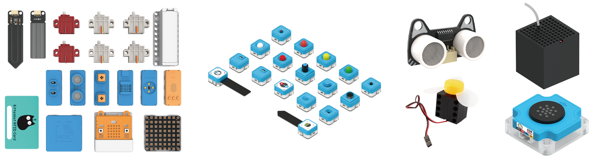

# 各種功能模組

<figure><figcaption></figcaption></figure>


[pwmodules](pwmodules/)



[sugar](sugar/)



[turbidity.md](turbidity.md)



[ph](ph/)



[kittenclock.md](kittenclock.md)



[infratemp.md](pwmodules/infratemp.md)



[waterpump.md](waterpump.md)



[ultrasound.md](ultrasound.md)



[geekfan.md](geekfan.md)



[fmradio.md](fmradio.md)



[rgb](rgb/)



[outdated](outdated/)

