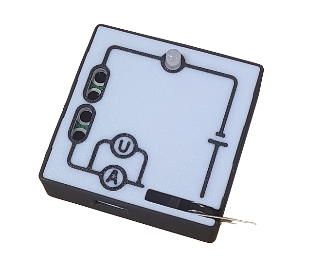
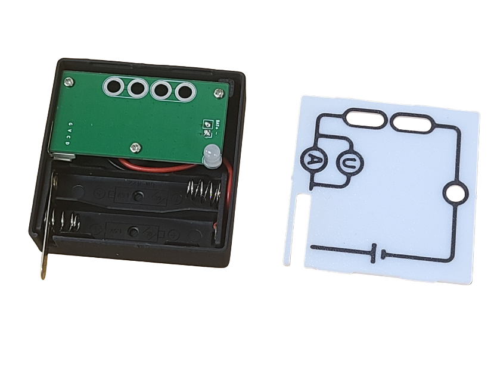
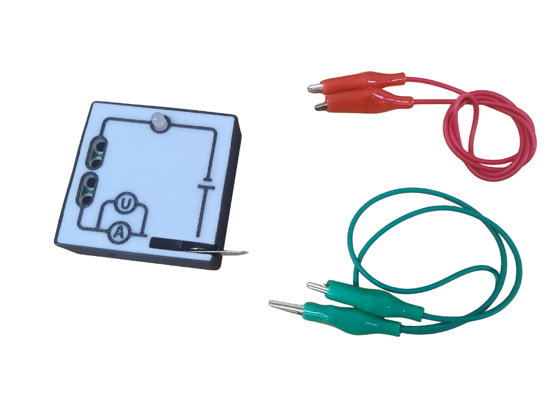
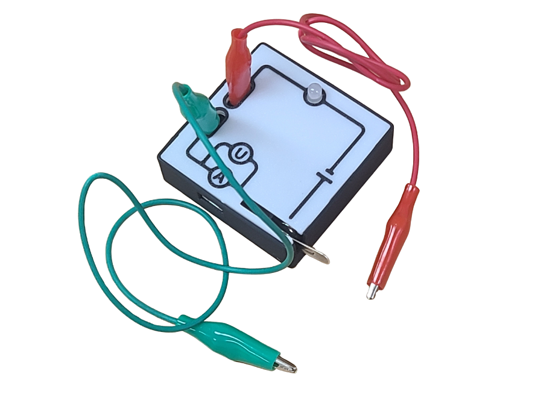
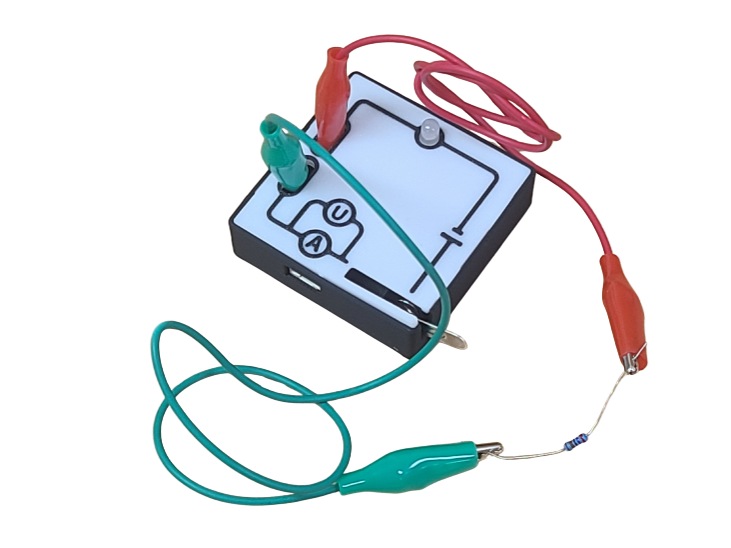

# 導電測試模組

<figure><figcaption></figcaption></figure>

這是一個可以測量物料導電性的模組,可以測量到電流讀數.

## 產品參數

* 接口: I2C

## 使用教學

#### 1. 打開模組上蓋,放入2粒2A電池

<figure><figcaption></figcaption></figure>

#### 2. 蓋上上蓋,連接鱷魚夾線

<figure><figcaption></figcaption></figure> <figure><figcaption></figcaption></figure>

#### 3. 接上要測試的物料,然後打開開關

<figure><figcaption></figcaption></figure>

## 接線教學

## 編程教學
