# 導電測試模組

<figure>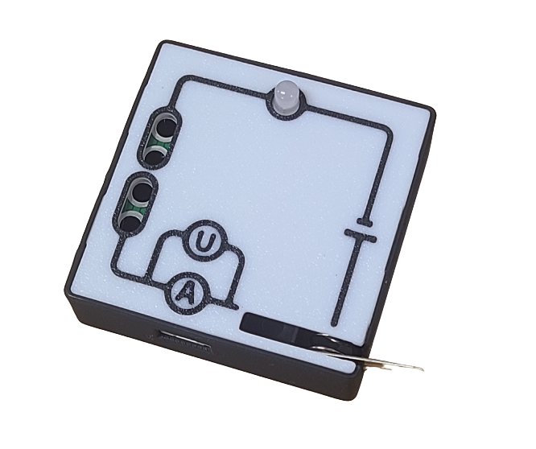<figcaption></figcaption></figure>

這是一個可以測量物料導電性的模組,可以測量到電流讀數.

## 產品參數

* 接口: I2C
* 類型: I2C 模組

## 產品接線

### FutureLite AI

<figure>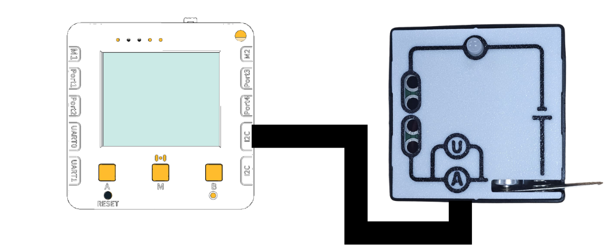<figcaption></figcaption></figure>

## 使用教學

#### 1. 打開模組上蓋,放入2粒AAA電池

<figure>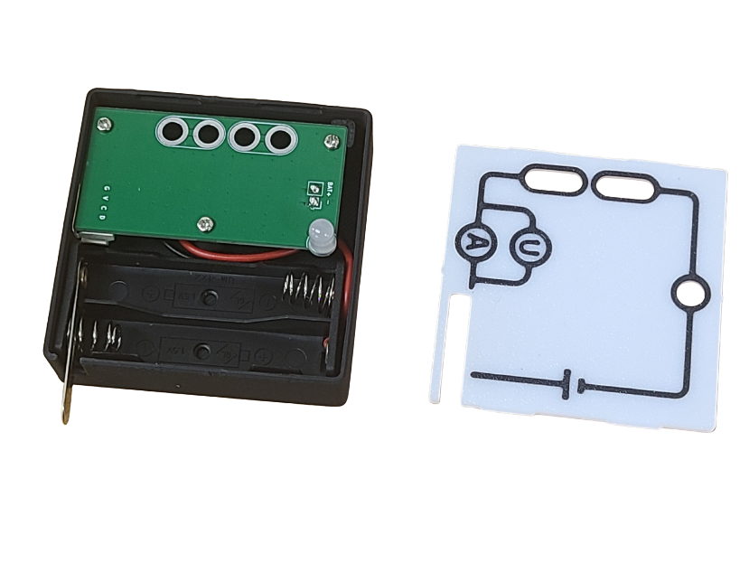<figcaption></figcaption></figure>

<figure>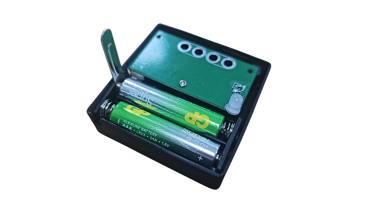<figcaption></figcaption></figure>

#### 2. 蓋上上蓋,連接鱷魚夾線

<figure>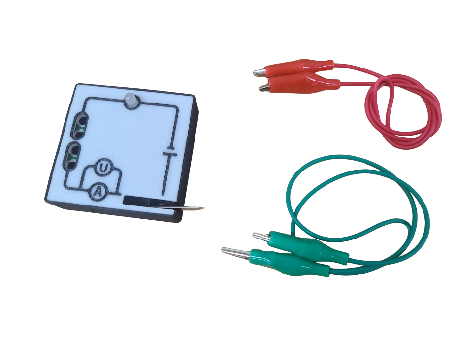<figcaption></figcaption></figure> <figure>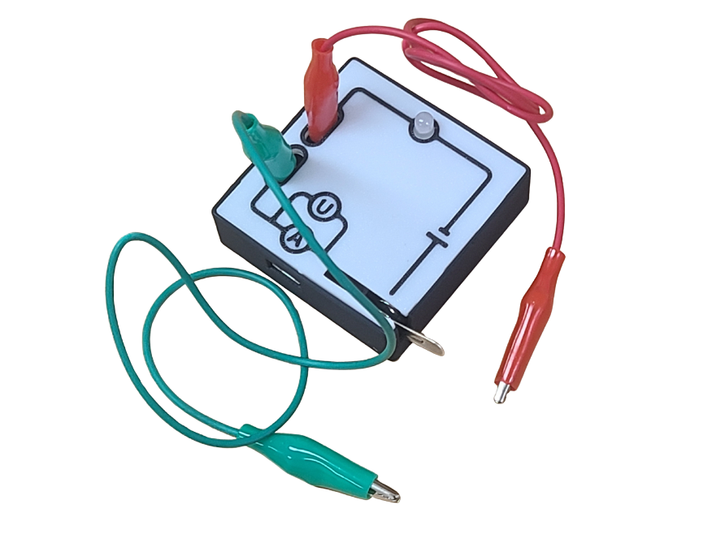<figcaption></figcaption></figure>

#### 3. 接上要測試的物料,然後打開開關

<figure>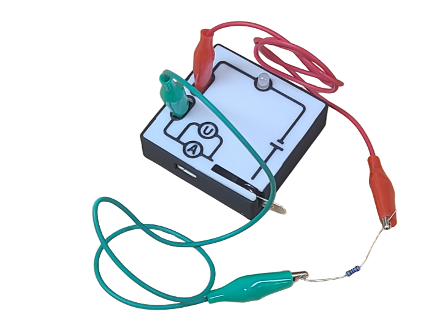<figcaption></figcaption></figure>

#### 4. 假如物料能夠導電，模組上的紅色LED會亮起

<figure>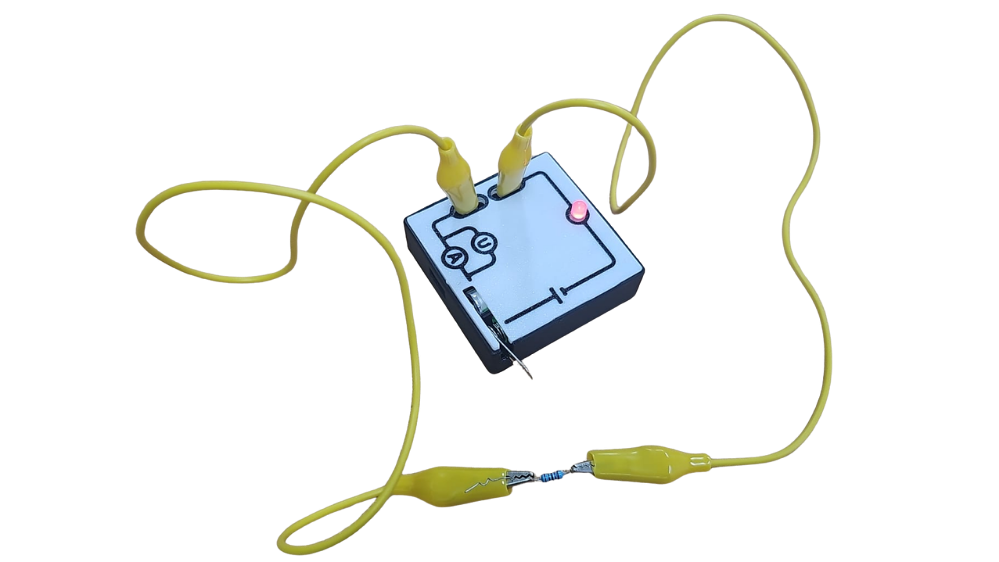<figcaption></figcaption></figure>

## 產品示範

### 在連接不同導電性的物料時，量度到的電壓會變化，導電性能越高電壓就越高。

### 1. 連接220ohm電阻: 1.12mA

<figure>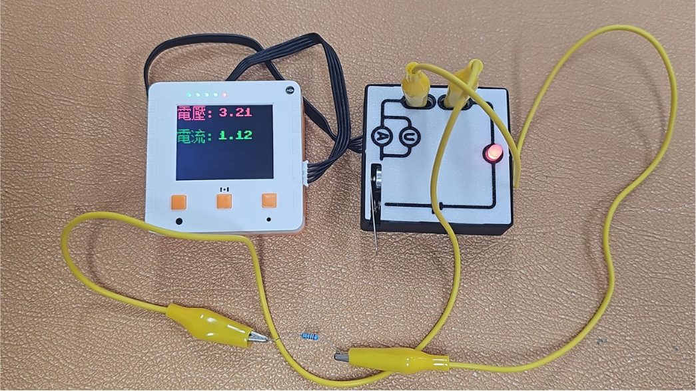<figcaption></figcaption></figure>

### 2. 連接鍍錫銅線: 1.32mA

<figure>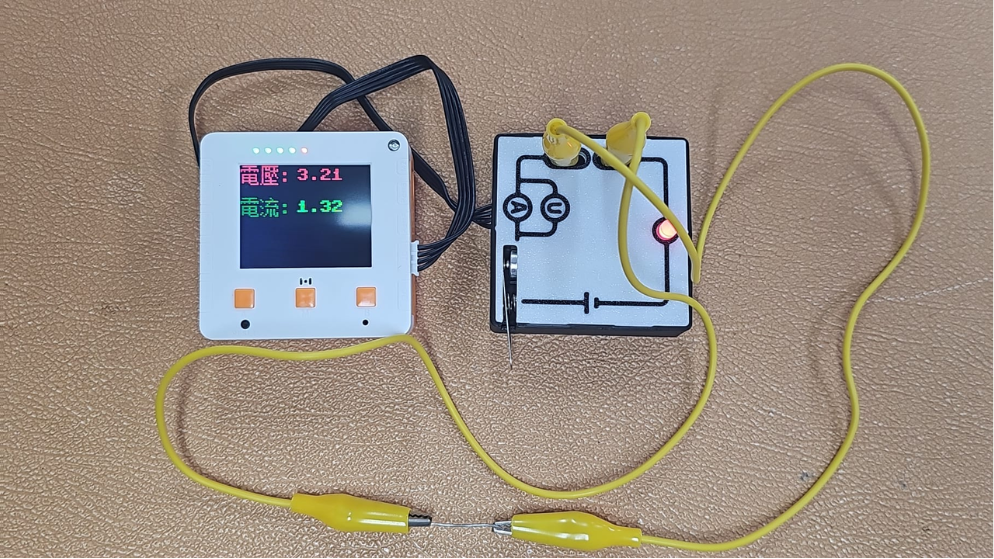<figcaption></figcaption></figure>

### 3. 連接螺絲: 1.34mA

<figure>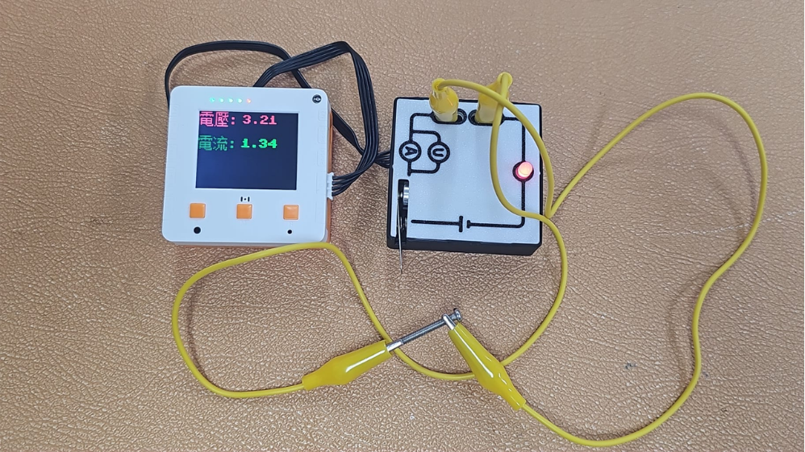<figcaption></figcaption></figure>

### 4. 沒有連接任何物料: 0mA

<figure>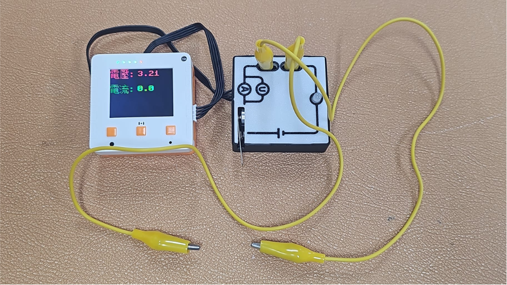<figcaption></figcaption></figure>

