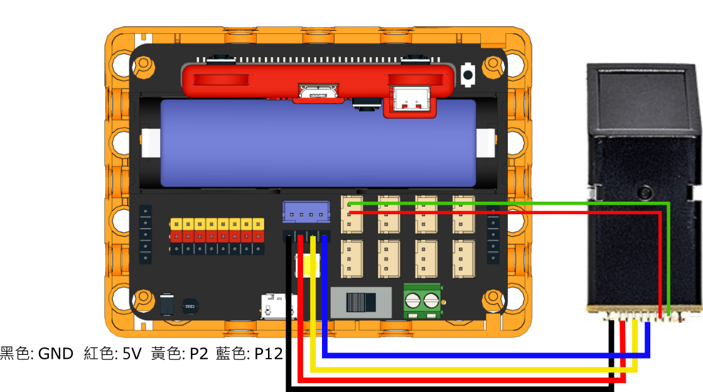

# 手指模辨識模組

<figure><figcaption></figcaption></figure>

手指模辨識模組可以錄入及辨識到10組指紋，適合用於智能家居/防盜安全等的應用項目。

### 產品參數

* 工作電壓：5V
* 接口：4pin杜邦接口+3pin防反插接口

### 接線教學

將模組的4Pin杜邦線連接到Robotbit Edu的串口接口，將3Pin防反插連接線連接到任意一個防反插接口。

<figure><figcaption></figcaption></figure>

<figure><figcaption></figcaption></figure>

### MakeCode 編程教學

<figure><figcaption></figcaption></figure>

#### 在擴展頁直接搜尋Robotbit (Robotbit已經過微軟認證，可以直接搜尋)[¶](/broken/pages/7UMrfr98MwaU3ENjeG6H)

<figure><figcaption></figcaption></figure>

#### 感應器Plus插件：[https://github.com/kittenbothk/pxt-ModulePlus](https://github.com/kittenbothk/pxt-ModulePlus)[¶](/broken/pages/7UMrfr98MwaU3ENjeG6H)

#### [詳細方法](../programmingplatforms/makecode/kittenbotandmakecode.md)

#### 手指模辨識模組積木塊：

<figure><figcaption></figcaption></figure>

#### 手指模辨識模組編程

#### 錄入手指模參考程式



[參考程式網址](https://makecode.microbit.org/_W6ADjH3efezz)

#### 手指模辨識參考程式



[參考程式網址](https://makecode.microbit.org/_4cRfKYcjid8D)

#### 插件版本與更新[¶](/broken/pages/7UMrfr98MwaU3ENjeG6H)

插件可能會不定時推出更新，改進功能。亦有時候我們可能需要轉用舊版插件才可使用某些功能。

詳情請參考: [Makecode插件版本更換](../programmingplatforms/makecode/makecodeextupdate.md)

