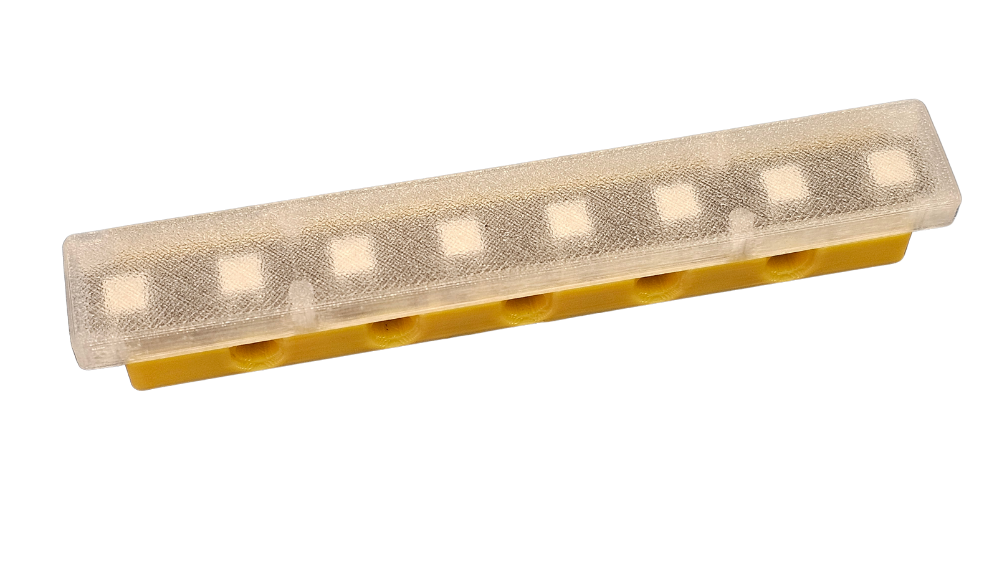
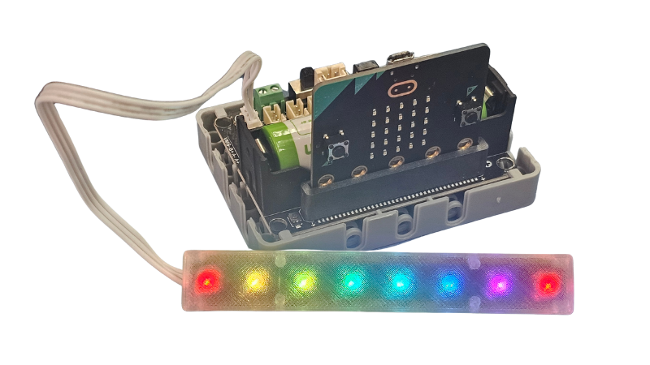
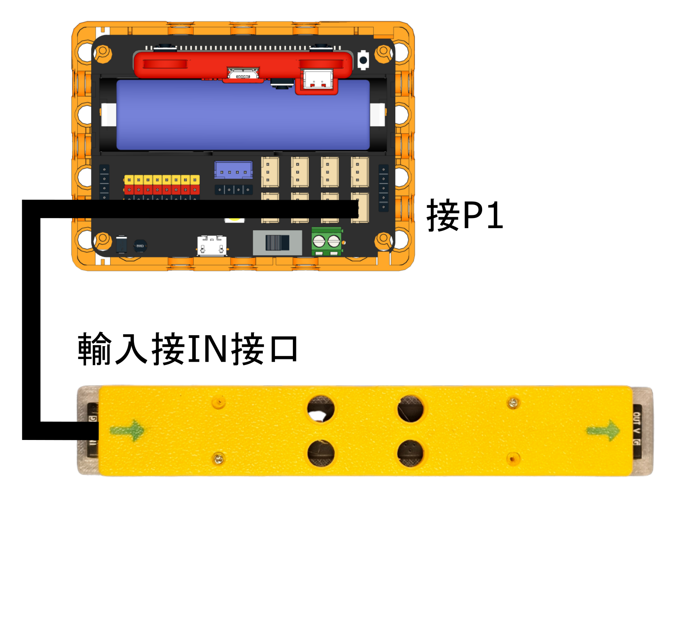
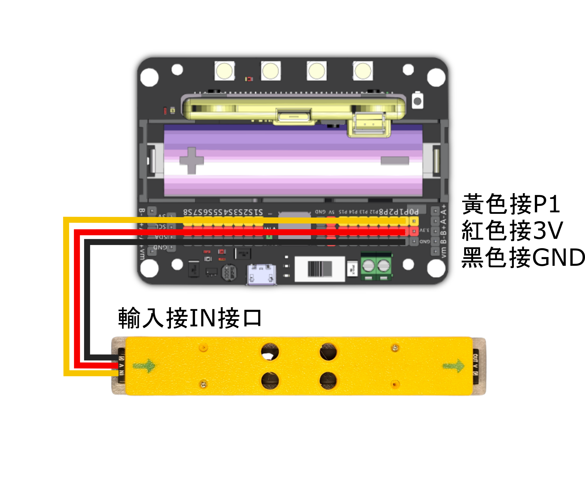
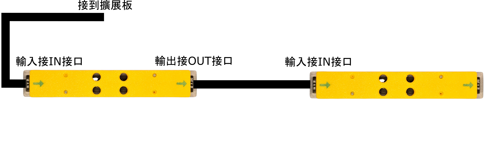

# Mini LED Tube

這是一隻兼用積木結構的全彩LED燈條，細小的體積已經配備8粒RGB LED，更加可以透過串聯的方式將多條燈條連接起來，外殼配有透明散光罩，令燈光效果不刺眼。

### 產品特點

1. 支援3V驅動，更適合micro:bit創作環境
2. 兼容樂高結構件，拼砌更直接
3. 可以串聯多個燈條
4. 散光罩令燈光效果更柔和

<figure><figcaption></figcaption></figure>

### 產品參數

* 工作電壓：3V\~5V
* 燈珠：8粒
* 接口：防反插接口

### 接線教學

### Robotbit EDU

<figure><figcaption></figcaption></figure>

### Robotbit 2.2

<figure><figcaption></figcaption></figure>

### 串聯接線

<figure><figcaption></figcaption></figure>

### MakeCode編程教學

#### Microbit:

#### 加載Robotbit插件：

#### 在擴展頁直接搜尋robotbit (robotbit已經過微軟認證，可以直接搜尋)

#### 你亦可以用插件地址搜尋

robotbit插件：https://github.com/KittenBot/pxt-robotbit

#### [詳細方法](../programmingplatforms/makecode/kittenbotandmakecode.md)

#### NeoPixel積木塊：

<figure><figcaption></figcaption></figure>



[參考程式網址](https://makecode.microbit.org/_fvDR70C9VMVs)
