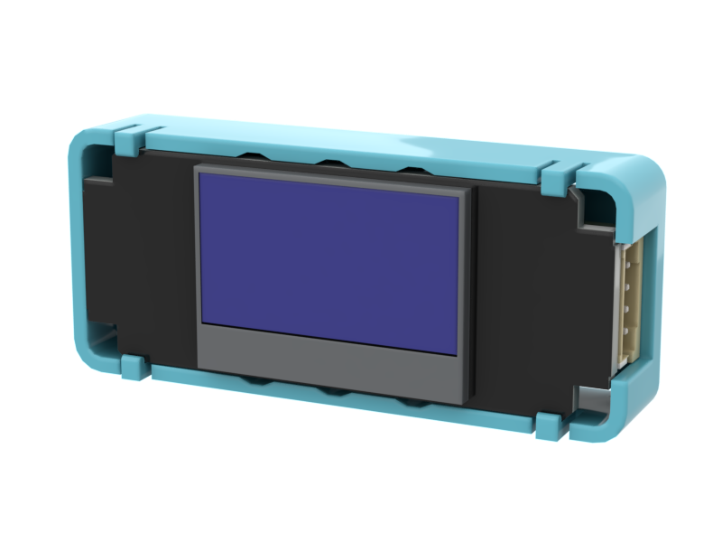

# OLED顯示屏魔塊

<figure><figcaption></figcaption></figure>

### 產品參數

* 工作電壓：3.3V\~5V
* 解像度：128\*64

### 接線教學

將模組用4pin排線連接至Robotbit的I2C接口。

### MakeCode編程教學

#### 加載PowerBrick插件：https://github.com/KittenBot/pxt-sugar

#### [詳細方法](../programmingplatforms/makecode/kittenbotandmakecode.md)

#### OLED積木塊：

<figure><figcaption></figcaption></figure>

#### OLED編程



[參考程式網址](https://makecode.microbit.org/\_C8r4uVEeiTe7)

### 插件版本與更新

PowerBrick插件可能會不定時推出更新，改進功能。亦有時候我們可能需要轉用舊版插件才可使用某些功能。

詳情請參考: [Makecode插件版本更換](../programmingplatforms/makecode/makecodeextupdate.md)
