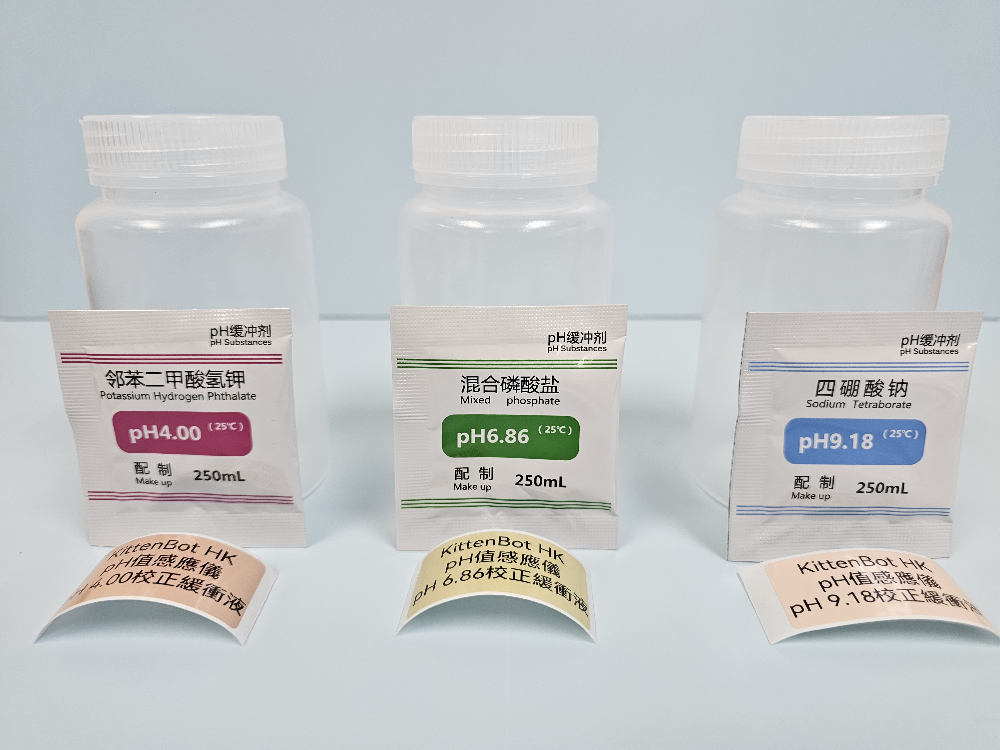
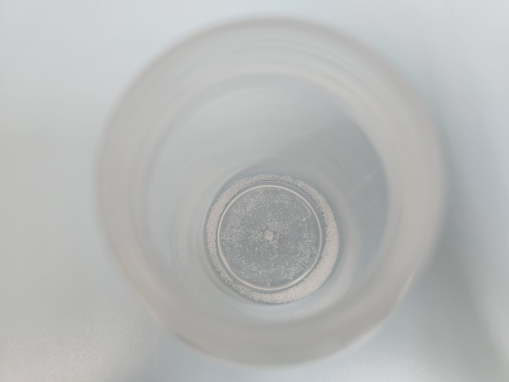
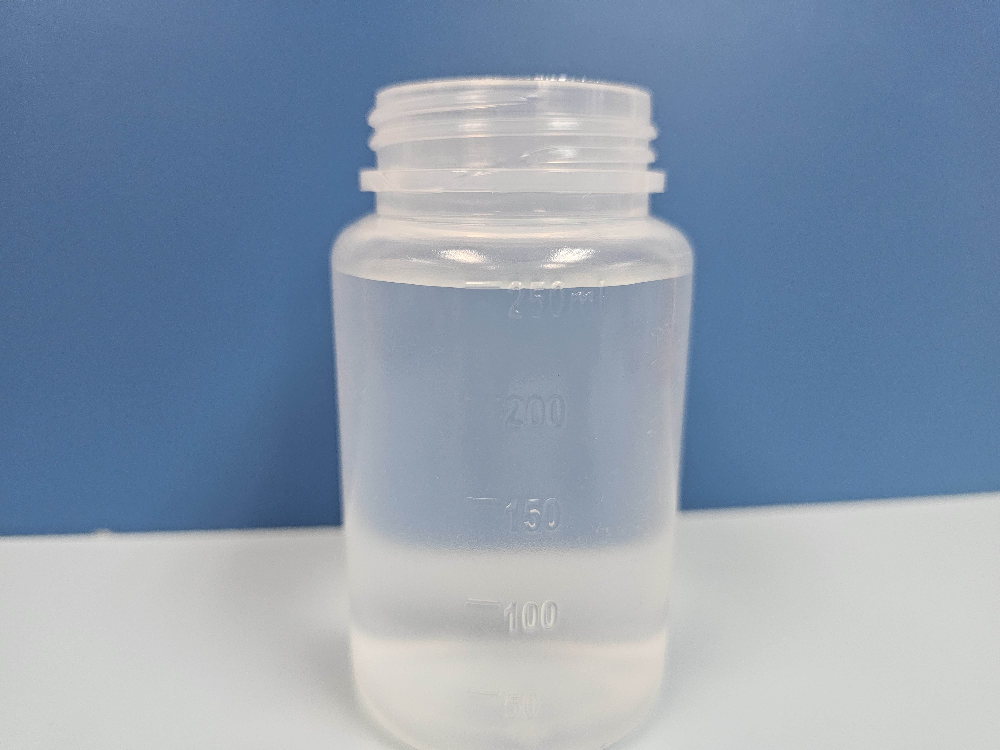

# pH緩衝液準備教學(高階用戶)

pH探測棒較正時, 需要pH校正緩衝液協助下進行，請按照以下教學沖制緩衝液。

<figure><figcaption>
3款pH校正緩衝液
</figcaption></figure>

首先準備以下材料：

* 250mL膠樽 \*3
* 緩衝液沖劑粉(pH 4.00, pH 6.86, pH 9.18各一包)
* 緩衝液標籤貼紙

以下以pH6.86緩衝液為例

### 調製緩衝液

首先使用清水將膠樽洗乾淨，並徹底抹乾。

將緩衝液沖劑粉倒進空樽裏。

<figure><figcaption></figcaption></figure>

將250毫升蒸餾水倒進膠樽裏，使用少量蒸餾水沖洗沖劑粉包裝，確保包裝裏的所有粉末完全溶解再倒進膠樽。

<figure><figcaption></figcaption></figure>

扭緊樽蓋然後搖勻溶液，確保所有粉末都被水溶解。完成後貼上標籤貼紙。

<figure><figcaption>
pH 6.86 校正液
</figcaption></figure>

### 緩衝液使用指引

* 為確保緩衝液的質量，請避免長時間打開樽蓋，令緩衝液暴露於空氣之中。
* 建議每次倒出少量的緩衝液作校正之用並於使用後棄置。

### 緩衝液安全指引

緩衝液的沖劑粉均為比較安全的化學物，但是仍需要注意以下事項。

* 避免吞服：雖然粉劑無毒無害，但請避免吞服導致肚瀉嘔吐等症狀。
* 避免接觸皮膚：雖然粉劑無毒無害，但有機會因為過敏導致痕癢。
