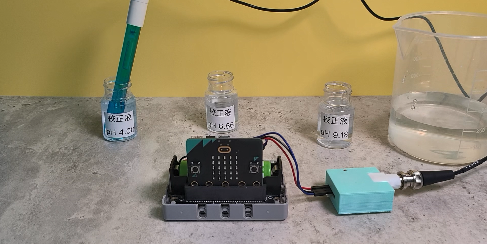
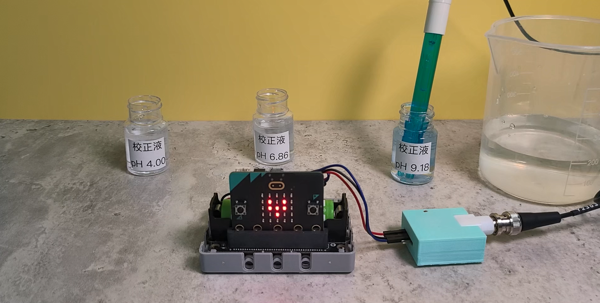

# pH探測棒重新校正(高階用家)

### <mark style="color:orange;">Kittenbot 的pH感應器在出廠時已經進行了模板校正;</mark>&#x20;

#### <mark style="color:blue;">Microbit 用戶:</mark>

較正值 (A, B)則已貼在探測棒上, 一般用家不需要進行探測棒校正。

#### <mark style="color:blue;">未來板lite用戶:</mark>

一般在出廠前, pH探測模組及探測棒已經跟某一未來板lite配對好, 即較正值已寫入在未來板lite 的內存中

### <mark style="color:orange;">什麼時候需要用緩衝液再次為pH 探測棒較正?</mark>

<mark style="color:blue;">Microbit 用戶:</mark>&#x20;

1.當你遺失了貼在pH 探測棒上的較正值時, 你便需要自行通過較正再次取得較正值 或向Kittenbot HK 查詢。

2.當你發覺探測出來的pH值不太準確時, 可以嘗試利用緩衝液再次進行一次較正, 取得更新的一組較正值。

<mark style="color:blue;">未來板lite用戶:</mark>&#x20;

1.當你發覺探測出來的pH值不太準確時, 可以嘗試利用緩衝液再次進行一次較正, 取得更新的一組較正值。

### <mark style="color:orange;">如何再次為pH 探測棒較正?</mark>

#### <mark style="color:blue;">microbit 用戶</mark>

1. 先按[教學](buffersolution.md), 準備好4.0及9.18緩衝液。
2. 下載以下程式到Micro:bit。



#### [參考程式](https://makecode.microbit.org/_ibPKjtApFKXm)

3. 將pH感應器浸入pH4.0的緩衝液裏，並等待1分鐘然後按下A鍵。

<figure><figcaption></figcaption></figure>

4. 使用蒸餾水沖洗探測棒然後紙巾徹底清潔和抹乾探測棒。
5. 將pH感應器浸入pH9.18的緩衝液裏，並等待1分鐘然後按下B鍵。

<figure><figcaption></figcaption></figure>

6. 按下A+B鍵，然後將Micro:bit顯示的AB較正值抄下來。

7. 下次使用時，就可以將抄下來的A和B數值寫入設定積木直接使用。

<pre><code><strong>每隻pH感應器的校正數值都可能不一樣，有可能不可以共通使用。
</strong></code></pre>



#### [參考程式](https://makecode.microbit.org/_1U7VAifgsduh)

#### <mark style="color:blue;">未來板Lite 用戶</mark>

1. 先按[教學](buffersolution.md), 準備好4.0及9.18緩衝液。
2. 打開未來板上預載程式ph\_save\_p1.py。

1. 將pH感應器浸入pH4.0的緩衝液裏，並等待1分鐘然後按下A鍵。

<figure><figcaption></figcaption></figure>

4. 使用蒸餾水沖洗探測棒然後紙巾徹底清潔和抹乾探測棒。
5. 將pH感應器浸入pH9.18的緩衝液裏，並等待1分鐘然後按下B鍵。

<figure><figcaption></figcaption></figure>

6. 按下A+B鍵，然後將Micro:bit顯示的AB較正值抄下來。
7. 下次使用時，就可以將抄下來的A和B數值寫入設定積木直接使用。

<pre><code><strong>每隻pH感應器的校正數值都可能不一樣，有可能不可以共通使用
</strong></code></pre>

