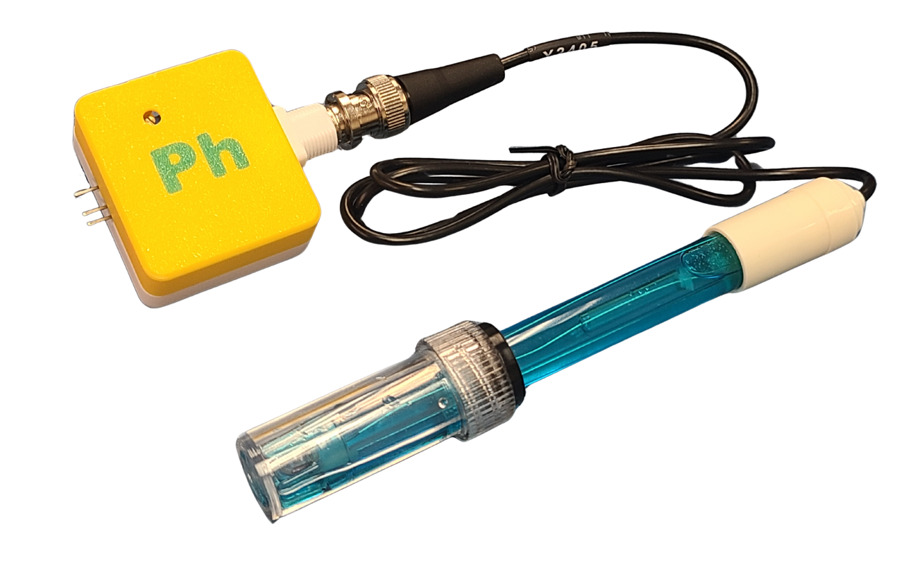

# pH酸鹼值探測組合

<figure><figcaption></figcaption></figure>

pH酸鹼值採測組合可以檢測液體的pH值。

### <mark style="color:orange;">產品參數</mark>

* 檢測範圍: pH 0 \~ pH 14
* 工作溫度: 0\~60 ℃
* 工作電壓: 5V
* 反應時間: 1分鐘

### <mark style="color:orange;">產品內容</mark>

1. 轉接模組
2. pH探測棒

### <mark style="color:orange;">用前小知識</mark> 

1. 轉接模組 及 pH探測棒皆需要預先進行較正。
2. Kittenbot 的pH酸鹼值探測組合在出廠時已經進行了完整校正，一般用家並不需要再進行校正。
3. 由於轉接模組 及 pH探測棒需要<mark style="color:red;">**配合同時使用**</mark><mark style="color:red;">,</mark> 較正好的組合<mark style="color:red;">**不能分拆**</mark>跟另一組合混合使用, 除非再次進行較正, 取得新組合的較正值。
4. <mark style="color:green;">如配合未來板lite</mark> 使用, 轉接模組+ pH探測棒的較正值需預先寫入未來板lite。寫入方法請參考[配對使用教學](phvalues_futurelite.md)。
5. 同一組合(即未來板lite+接模組+ pH探測棒)只需寫入1次較正值, 下次使用不需再次寫入。如未來板lite A配搭上另一組pH探測組合B 使用, 便需要重覆上述步驟4, 寫入新的較正值。
6. <mark style="color:green;">如配合microbit</mark> 使用, 只需在程式積木中, 寫入出廠所提供的較正值便可, 詳情參考[編程教學](phuse.md)。

### <mark style="color:orange;">注意事項</mark>

1. 感應器頭部帶有保護蓋，使用前請小心扭下保護瓶，然後將瓶蓋拆下來。
2. 請勿弄污、弄花感應器的頭部。
3. 請小心不要倒瀉保護瓶的液體。
4. 每次使用後都需要使用蒸餾水清潔感應器。
5. 使用過後請將保護瓶裝回，不要將感應器暴露在空氣中。
6. 這種感應器並不是即時有反應，請耐心等待1分鐘。
7. 使用上強酸/強鹼時，請加以小心並佩戴護目鏡。

### 接線教學

將3V3線接到VCC針腳，GND線接到GND針腳，訊號線(P0, P1, P2)接到S針腳。

<table><thead><tr><th width="100">擴展板</th><th width="100">pH轉接模組</th></tr></thead><tbody><tr><td>3V3</td><td>V</td></tr><tr><td>GND</td><td>G</td></tr><tr><td>P0/P1/P2</td><td>S</td></tr></tbody></table>

### Robotbit EDU

<figure><figcaption></figcaption></figure>

### Robotbit 2.2

<figure><figcaption></figcaption></figure>

### Armourbit

<figure><figcaption></figcaption></figure>
