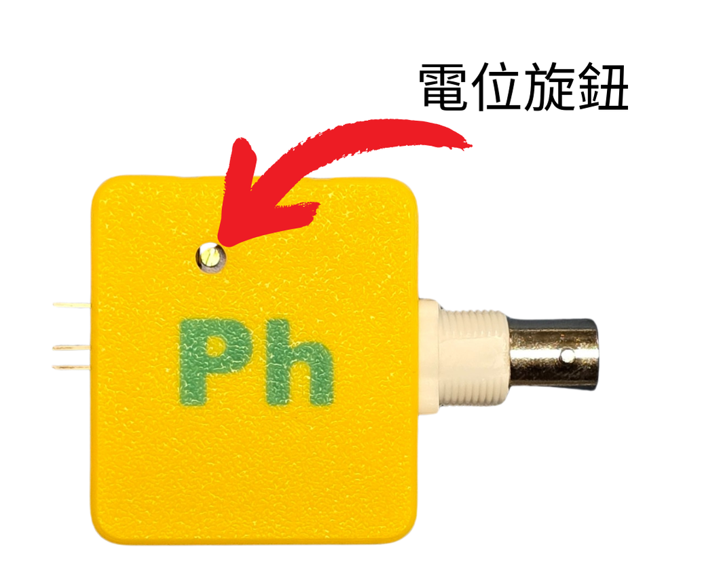

# 轉接模組校正(重新較正用)

### Kittenbot 的pH酸鹼值探測組合在出廠時已經進行了轉接模組較正，一般用家並不需要進行硬體校正, 請參考[用前小知識](phsensor.md)。

### 如pH酸鹼值探測組合在長時間沒使用，才建議對模組進行校正。(極少需要)

#### <mark style="color:red;">重申</mark>: 此校正步驟 ,只需進行一次，<mark style="color:red;">並非</mark>每次使用前都需要進行

### <mark style="color:orange;">如何對轉接模組進行較正?</mark>

1. 按接線方式, 把pH探測組合接上擴展板及microbit, 詳情請參考[接線教學](phsensor.md)。
2. 下載以下程式到micro:bit。



打開[參考程式](https://makecode.microbit.org/_gmJbuk5UbHEs)

#### 3. 使用一字螺絲批調節模組上的電位旋鈕

#### 4. 將pH探測棒的保護蓋拆開，然後浸入pH6.86校正液，並等待大約1分鐘。

#### 5. 當micro:bit顯示<mark style="color:red;">向上箭咀</mark>，請將模組上的電位器<mark style="color:red;">順時針</mark>扭動。

#### 6. 當micro:bit顯示<mark style="color:red;">向下箭咀</mark>，請將模組上的電位器<mark style="color:red;">逆時針</mark>扭動。

### 請慢慢扭動電位器，直至micro:bit顯示圓圈圖案。

### pH感應器MakeCode參考程式

### pH轉接模組初次校正示範短片


