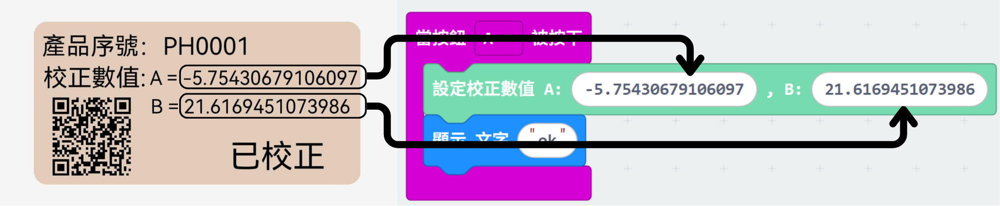

# pH酸鹼值探測組合+Micro:bit編程教學

### 編程教學

#### <mark style="color:orange;">MakeCode 編程教學</mark>

#### 在擴展頁直接搜尋Robotbit (Robotbit已經過微軟認證，可以直接搜尋)

#### 感應器Plus插件：https://github.com/kittenbothk/pxt-ModulePlus

#### [詳細方法](../../programmingplatforms/makecode/kittenbotandmakecode.md)

#### pH感應器積木塊

#### <mark style="color:orange;">MakeCode參考程式</mark>



打開[參考程式](https://makecode.microbit.org/_hU33u4FHuegC)

#### <mark style="color:orange;">pH酸鹼值探測組合程式解說</mark>

<figure><figcaption></figcaption></figure>

1. 將pH探測棒上的標貼所顯示的校正值, 分別填進程式的<mark style="color:green;">"設定校正數值"</mark> A和B中。
2. 將程式下載到Micro:bit。
3. 按下A鍵，正式完成模組校正。
4. 將pH探測棒浸到測量液當中，等待大約1分鐘。
5. 按下B鍵，檢測液的pH值便會隨即顯示在microbit上。
6. 檢測其他液體前, 須用蒸餾水洗淨pH探測棒, 並用紙巾徹底抹乾凈。

