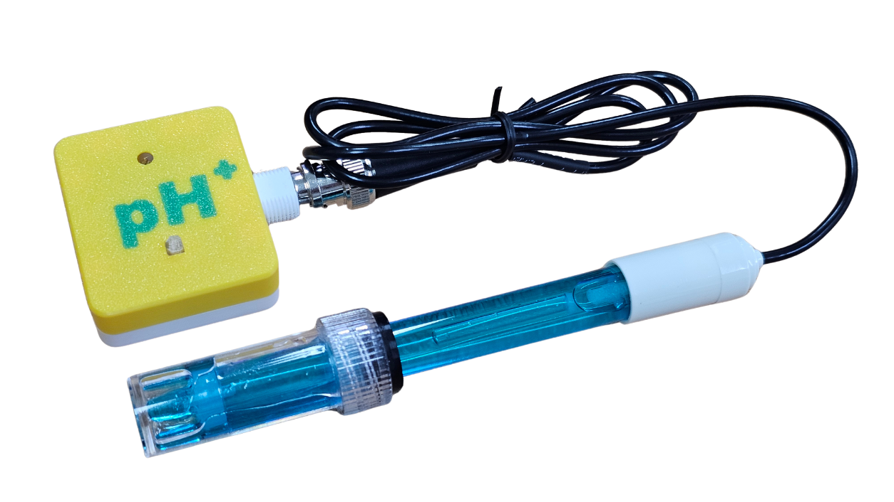

# pH值感應器Plus

<figure><figcaption></figcaption></figure>

Kittenbot全新設計的pH值感應器，市場上唯一自帶校正芯片的pH值感應器，不用每次使用前都進行校正，做到真正即插即用，大大減低pH值感應器的使用難度。

## 產品特色

* 不需校正，即插即用
  * 自帶校正芯片
  * 出廠已校正
* 反應敏捷
  * 讀數穩定只需大約30秒

## 產品參數

* 接口: I2C
* 電壓: 3v至5v

## 參考程式

插件地址: [https://github.com/evanli85618/pxt-ph-module](https://github.com/evanli85618/pxt-ph-module)



[參考程式](https://makecode.microbit.org/_bFk17JV9CE5t)
