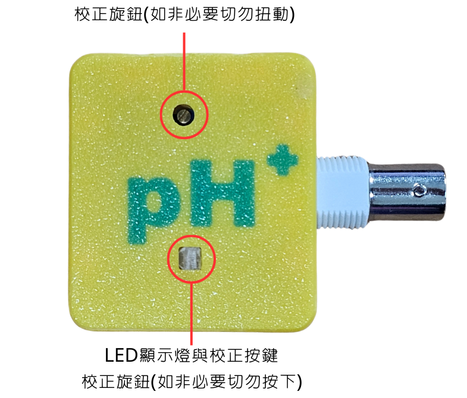
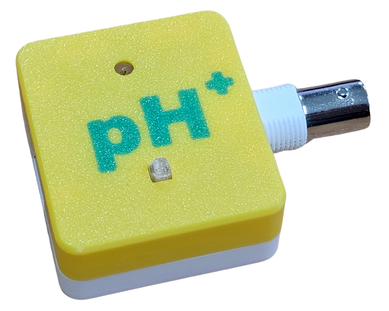

# pH值感應器Plus

<figure><figcaption></figcaption></figure>

Kittenbot HK全新設計的pH值感應器，市場上唯一自帶校正芯片的pH值感應器，不用每次使用前都進行校正，做到真正即插即用，大大減低pH值感應器的使用難度。

## 產品特色

* 不需校正，即插即用
  * 自帶校正芯片
  * 出廠已校正
* 反應敏捷
  * 讀數穩定只需大約30秒

## 產品參數

* 接口: I2C
* 電壓: 3v至5v
* 反應時間: 約30秒

## 產品展示

<figure><figcaption></figcaption></figure>

<figure><figcaption></figcaption></figure> <figure><figcaption></figcaption></figure>

### 示範短片



## 參考程式

插件地址: [https://github.com/kittenbothk/pxt-moduleplus](https://github.com/kittenbothk/pxt-moduleplus)



[參考程式](https://makecode.microbit.org/_5R0cJ012FdoC)

解說:
\
按A鍵顯示pH值，按B鍵顯示模擬值(0-4096)
