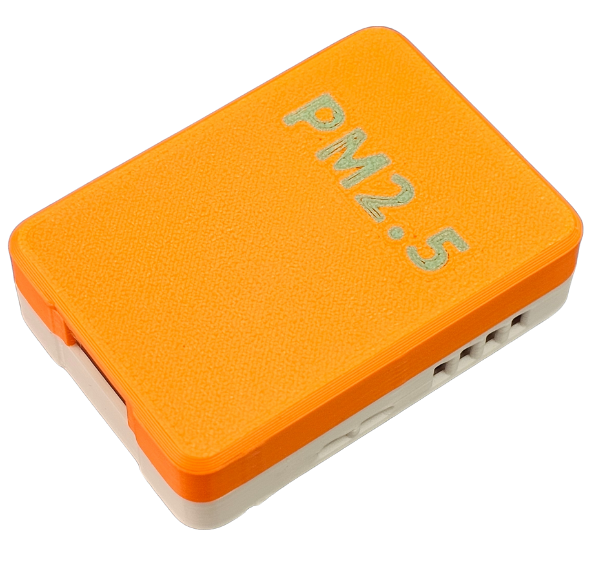
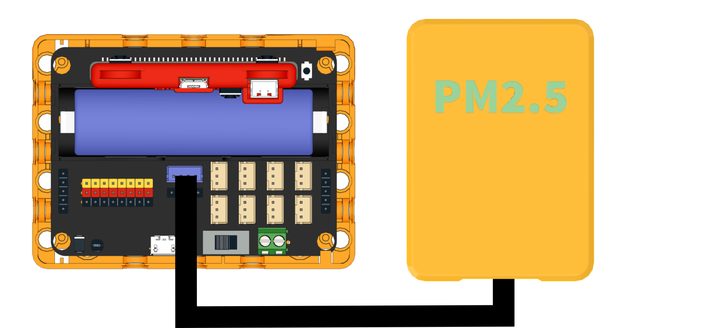

# PM2.5 感應器

<figure><figcaption></figcaption></figure>

PM2.5感應器可以檢測到空氣中的污染物懸浮粒子之濃度，除了PM2.5粒子外還可以檢測到PM10和PM1.0的濃度。

### 產品參數

接口: I2C

電壓: 3V\~5V

### 接線教學

將感應器連接到Robotbit EDU的I2C接口。

<figure><figcaption></figcaption></figure>

### 編程教學

#### MakeCode編程教學

#### 加載Sugar插件：

#### 在擴展頁直接搜尋sugar (sugar已經過微軟認證，可以直接搜尋)

#### 你亦可以用插件地址搜尋

Sugar插件：https://github.com/KittenBot/pxt-sugar

#### [詳細方法](../programmingplatforms/makecode/kittenbotandmakecode.md)


