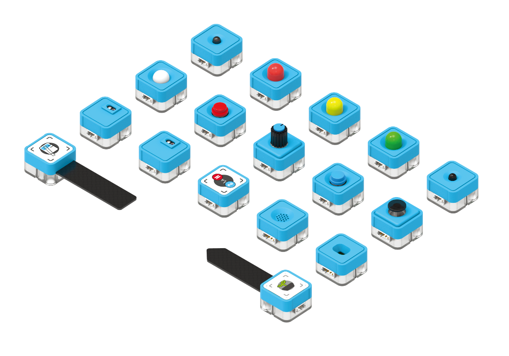

# Sugar系列模組

<figure><figcaption></figcaption></figure>

### Sugar 一期模組


[button.md](button.md)



[pir.md](pir.md)



[line.md](line.md)



[magnet.md](magnet.md)



[led.md](led.md)



[potentiometer.md](potentiometer.md)



[flame.md](flame.md)



[light.md](light.md)



[water.md](water.md)



[soil.md](soil.md)



[env.md](env.md)



[joystick.md](joystick.md)



[tof.md](tof.md)



[Broken link](broken-reference)


### Sugar 二期模組


[stringlights.md](stringlights.md)



[vibemotor.md](vibemotor.md)



[laser.md](laser.md)



[env2.md](env2.md)



[crash.md](crash.md)



[watertemp.md](watertemp.md)



[buzzer.md](buzzer.md)



[touch.md](touch.md)



[display.md](display.md)



[i2c\_hub.md](i2c\_hub.md)



[grayscale.md](grayscale.md)



[sugarcam](sugarcam/)

