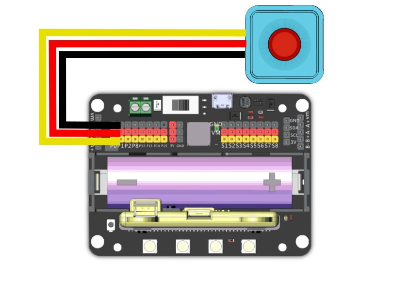

# Sugar 按鍵模組

<figure><figcaption></figcaption></figure>

這是一件按鍵模組，可以感測按鍵狀態。背後亦設有塑膠積木孔，可以完美配搭塑膠積木使用。

### 產品參數

* 尺寸：24 x 24 x 19 mm
* 重量：5.1g
* 訊號：按下為0，否則為1

### 產品接線[¶](broken-reference)

#### Robotbit EDU

用3Pin 連接線將模組與Robotbit Edu連接起來。

<figure><figcaption></figcaption></figure>

#### Robotbit 2.2

用3Pin 連接線將模組與Robotbit 2.2連接起來。

<figure><figcaption></figcaption></figure>

### 編程教學

### MakeCode編程教學

#### 加載Sugar插件：

#### 在擴展頁直接搜尋sugar (sugar已經過微軟認證，可以直接搜尋)[¶](broken-reference)

<figure><figcaption></figcaption></figure>

#### 你亦可以用插件地址搜尋

Sugar插件：[https://github.com/KittenBot/pxt-sugar](https://github.com/KittenBot/pxt-sugar)

#### 參考程式




[參考程式](https://makecode.microbit.org/\_JtxF8tVccMcF)




[參考程式](https://makecode.microbit.org/\_96T4zE6atA3T)

#### Kittenblock 編程教學

<figure><figcaption></figcaption></figure>

#### MicroPython 編程教學

* value(): 按下為0，否則為1

參考程式

```
from future import *
from sugar import *
import time

# 可用: P0、P1、P2、P3、P8、P13、P14、P15、P16
button = Button('P1')

x = 0
screen.sync = 0
screen.fill(0)
screen.text(x, x = 5, y = 5)
screen.refresh()
while True:
  if button.value() == 0:
    x += 1
    screen.fill(0)
    screen.text(x, x = 5, y = 5)
    screen.refresh()
    sleep(0.5)
```
