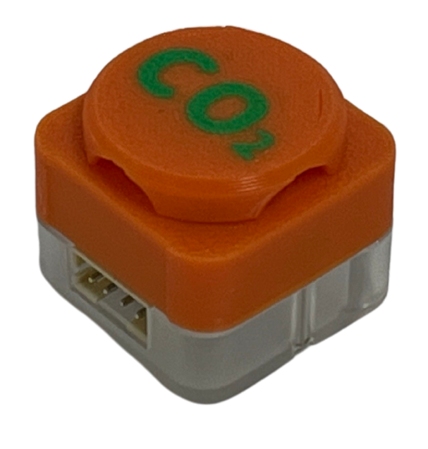

# Sugar二期 二氧化碳與溫濕度感應器

<figure><figcaption></figcaption></figure>

這是一個二氧化碳感應器，它可以感測到空氣中二氧化碳及環境溫度與濕度。

### 產品參數

* 尺寸：24 x 24 x 23 mm

### 產品接線

#### Robotbit Edu

用4Pin 連接線將模組與Robotbit Edu連接起來。

#### Robotbit 2.2

用4Pin 連接線將模組與Robotbit 2.2連接起來。

<figure><figcaption></figcaption></figure>

### 編程教學

#### MakeCode編程教學

#### 加載Sugar插件：

#### 在擴展頁直接搜尋sugar (sugar已經過微軟認證，可以直接搜尋)

#### 你亦可以用插件地址搜尋

Sugar插件：https://github.com/KittenBot/pxt-sugar

#### [詳細方法](../../programmingplatforms/makecode/kittenbotandmakecode.md)



[參考程式](https://makecode.microbit.org/\_HAU0AiEy7R9j)
