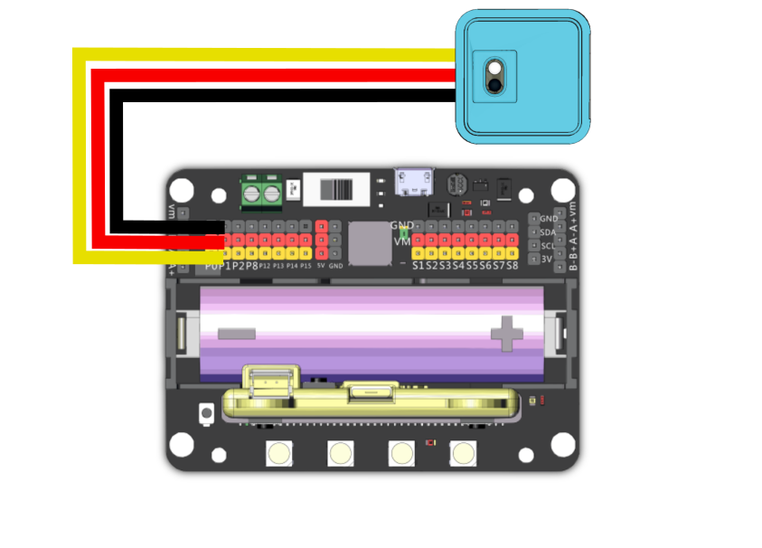

# Sugar 巡線模組


這是一隻紅外線巡線模組，主要用來檢測黑線。背後亦設有塑膠積木孔，可以完美配搭塑膠積木使用。

### 產品參數

* 尺寸：24 x 24 x 16 mm
* 重量：5g
* 訊號：檢測到黑線為1，否則為0
* 檢測距離：1\~14mm

### 產品接線

#### Robotbit Edu

用3Pin 連接線將模組與Robotbit Edu連接起來。


#### Robotbit 2.2

用3Pin 連接線將模組與Robotbit 2.2連接起來。

<figure><figcaption></figcaption></figure>

### 編程教學

### MakeCode編程教學

#### 加載Sugar插件：

#### 在擴展頁直接搜尋sugar (sugar已經過微軟認證，可以直接搜尋)


#### 你亦可以用插件地址搜尋

Sugar插件：https://github.com/KittenBot/pxt-sugar

#### [詳細方法](../../programmingplatforms/makecode/kittenbotandmakecode.md)



[參考程式](https://makecode.microbit.org/\_DuF9Y5MsRfTh)

#### Kittenblock 編程教學


#### MicroPython編程教學

```
Tracker(pin)
value()
```

* value(): 檢測到黑線為1，否則為0

參考程式

```
from future import *
from sugar import *

tracker = Tracker('P1')

screen.sync = 0
while True:
    if tracker.value() == 1:
        screen.fill(0)
    else:
        screen.fill(255)
    screen.refresh()
```
