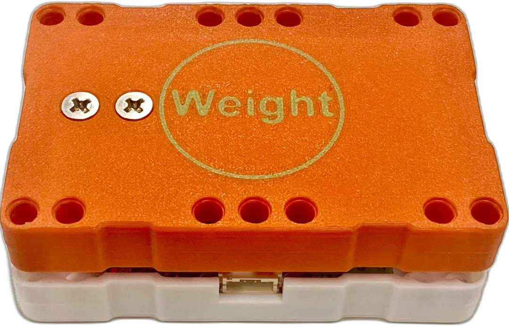

# Sugar二期 稱重模組

<figure><figcaption></figcaption></figure>

Sugar 稱重模組可以量度物件的重量。

## 產品參數：

* 尺寸: 88x56x33mm
* 訊號: I2C
* 可量度範圍: 0-5kg
* 精準度: 0.1g
* 電壓: 3.3V/5V

## 產品接線

<figure><figcaption></figcaption></figure>

## 參考程式

#### MakeCode編程教學

#### 加載Sugar插件：

#### 在擴展頁直接搜尋sugar (sugar已經過微軟認證，可以直接搜尋)

#### 你亦可以用插件地址搜尋

Sugar插件：https://github.com/KittenBot/pxt-sugar

#### [詳細方法](../../programmingplatforms/makecode/kittenbotandmakecode.md)

### 量度重量



[參考程式](https://makecode.microbit.org/\_W020dvAC6XTU)
