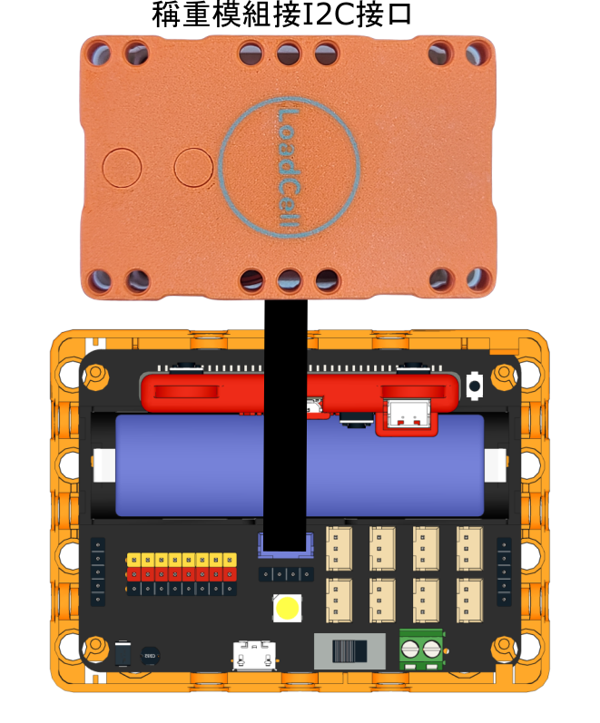
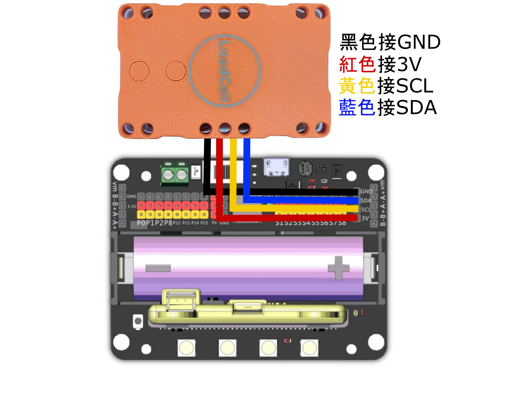

# Sugar二期 稱重模組

<figure><figcaption></figcaption></figure>

Sugar 稱重模組可以量度物件的重量。

## 產品參數：

* 尺寸: 88x56x33mm
* 訊號: I2C
* 可量度範圍: 0-5kg
* 精準度: 0.1g
* 電壓: 3.3V/5V

## 產品接線

#### Robotbit EDU

<figure><figcaption></figcaption></figure>

#### Robotbit 2.2

<figure><figcaption></figcaption></figure>

## 參考程式

#### MakeCode編程教學

#### 加載Sugar插件：

#### 在擴展頁直接搜尋sugar (sugar已經過微軟認證，可以直接搜尋)

#### 你亦可以用插件地址搜尋

Sugar插件：https://github.com/KittenBot/pxt-sugar

#### [詳細方法](../../../programmingplatforms/makecode/kittenbotandmakecode.md)

### 量度重量

Micro:bit上使用稱重模組需要手動輸入校正數值。首先打開以下參考程式。

#### 參考程式



[下載參考程式](https://makecode.microbit.org/_HmwKUrD8iPW9)

在程式中將模組背後印有的校正數值填在程式的 設定校準值 積木裡面。

<figure><figcaption></figcaption></figure>
