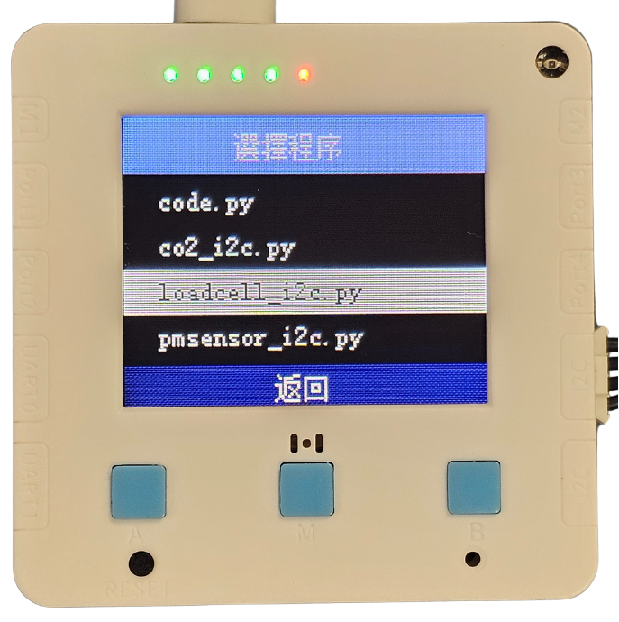

# 校正數值使用教學

所有稱重模組在出廠時已經校正好，模組背後貼有該模組的ID和相應校正數值。

<figure><figcaption></figcaption></figure>

## 科學測量套件: 未來板Lite使用教學

科學測量套件的未來板Lite已經和稱重模組配對好，只需將ID相同的未來板Lite和稱重模組配合使用即可。

<figure><figcaption></figcaption></figure>

按實M鍵不要放手然後打開未來板Lite的電源，直至未來板進入選項畫面才鬆手。選擇loadcell\_i2c.py，程式就會自動載入校正數值。

<figure><figcaption></figcaption></figure>



<figure><figcaption></figcaption></figure>

## 科學測量套件: Micro:bit使用教學

Micro:bit上使用稱重模組需要手動輸入校正數值。首先打開以下參考程式。

#### 參考程式



[下載參考程式](https://makecode.microbit.org/_HmwKUrD8iPW9)

在程式中將模組背後印有的校正數值填在程式的 設定校準值 積木裡面。

<figure><figcaption></figcaption></figure>

