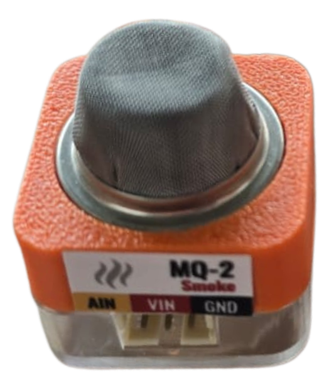
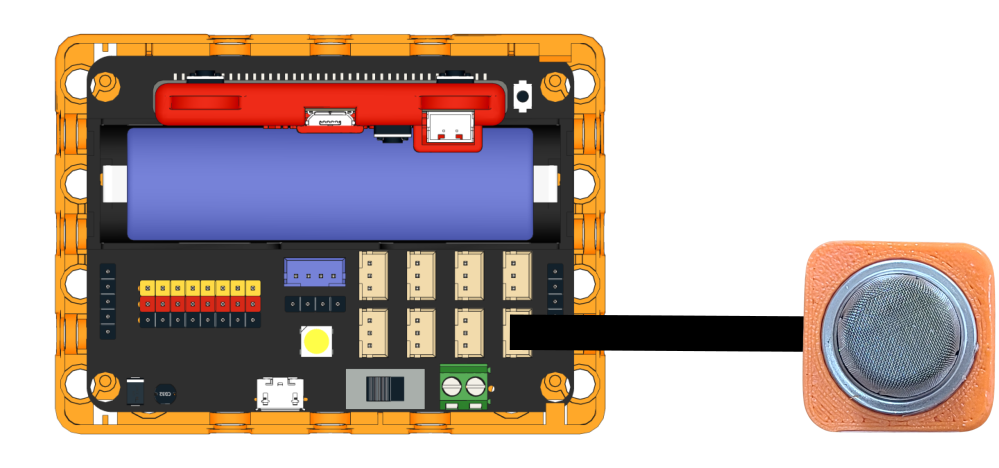
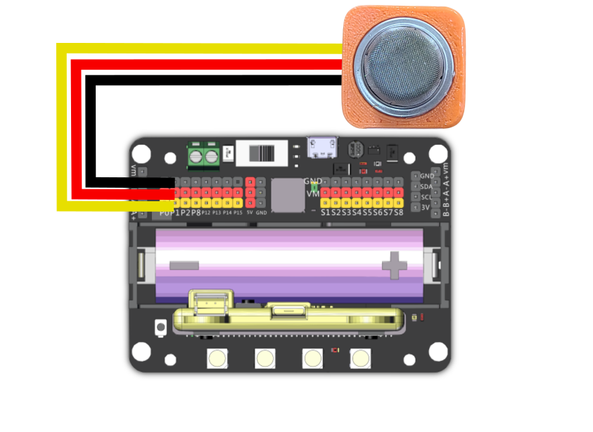
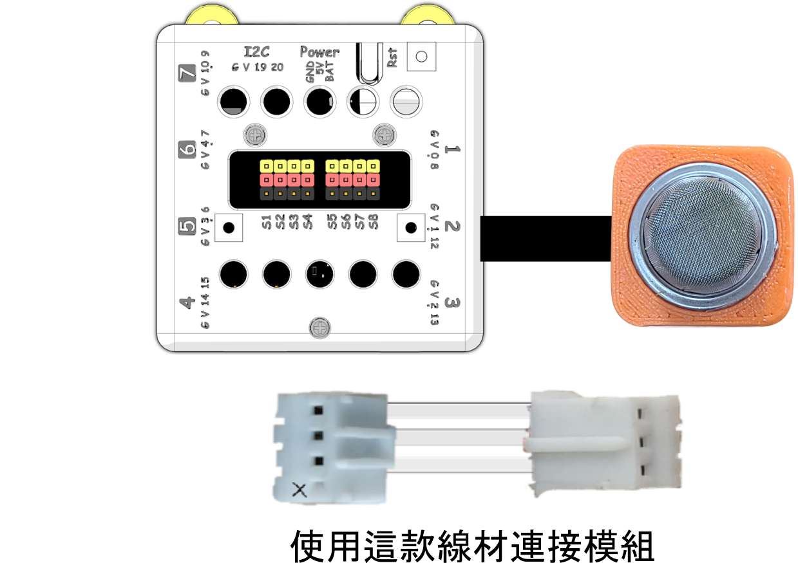

# Sugar 二期MQ2煙霧感應器模組

這是一個煙霧感應器。

### 產品參數

* 尺寸：24 x 24 x 23 mm
* 類型：Analog 模擬模組

### 產品接線

#### Robotbit Edu

用3Pin 連接線將模組與Robotbit Edu連接起來。

<figure><figcaption></figcaption></figure>

#### Robotbit 2.2

用3Pin 連接線將模組與Robotbit 2.2連接起來。

<figure><figcaption></figcaption></figure>

### Armourbit

<figure><figcaption></figcaption></figure>

### 編程教學

#### MakeCode編程教學

#### 加載Sugar插件：

#### 在擴展頁直接搜尋sugar (sugar已經過微軟認證，可以直接搜尋)

#### 你亦可以用插件地址搜尋

Sugar插件：https://github.com/KittenBot/pxt-sugar

#### [詳細方法](../../programmingplatforms/makecode/kittenbotandmakecode.md)



[參考程式](https://makecode.microbit.org/_6yP6CoWwoLAY)
