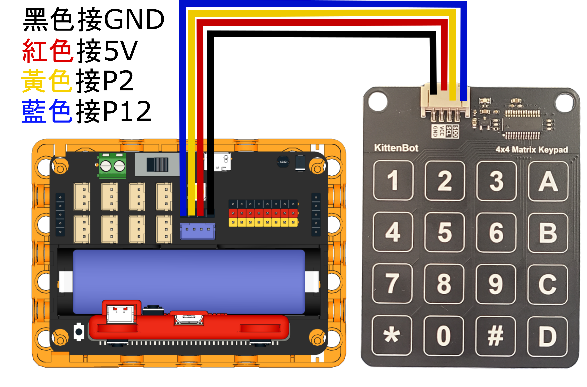
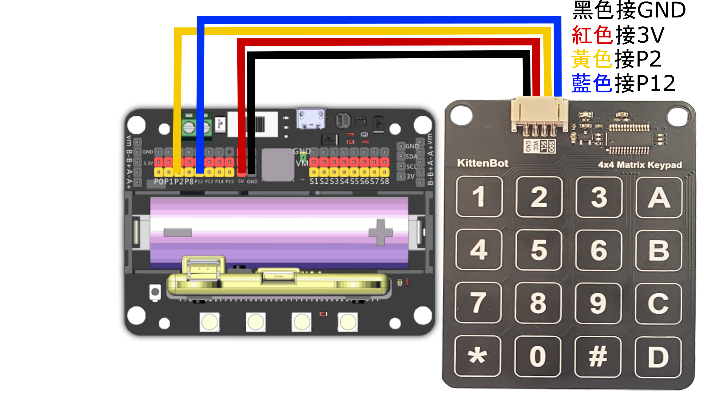

# Sugar 二期數字鍵盤模組

<figure><figcaption></figcaption></figure>

這是一個16鍵的電容式觸碰鍵盤模組，適合用於智能家居密碼門等輸入場景。

## 產品參數：

* 操作電壓：3.3\~5V
* 尺寸：56 x 72 x 7.2 mm

## 產品接線

#### Robotbit EDU

<figure><figcaption></figcaption></figure>

#### Robotbit 2.2

<figure><figcaption></figcaption></figure>

## 參考程式

#### MakeCode編程教學

#### 加載Sugar插件：

#### 在擴展頁直接搜尋sugar (sugar已經過微軟認證，可以直接搜尋)

#### 你亦可以用插件地址搜尋

Sugar插件：https://github.com/KittenBot/pxt-sugar

#### [詳細方法](../../programmingplatforms/makecode/kittenbotandmakecode.md)



[參考程式](https://makecode.microbit.org/\_AE3Hc2VWP30J)

