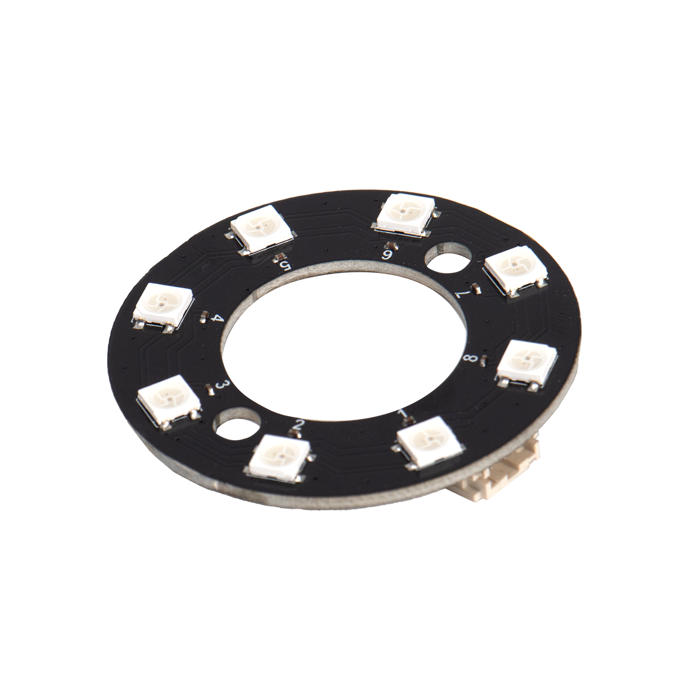

# Sugar 二期RGB燈圈模組

<figure><figcaption></figcaption></figure>

這是一個裝有8粒RGB彩燈的燈圈模組，可以顯示各種燈光效果。

## 產品參數：

* 操作電壓：3.3\~5V

## 產品接線

## 參考程式

#### MakeCode編程教學

#### 加載Robotbit插件：

#### 在擴展頁直接搜尋robotbit (robotbit已經過微軟認證，可以直接搜尋)

#### 你亦可以用插件地址搜尋

Sugar插件：https://github.com/KittenBot/pxt-robotbit

#### [詳細方法](../../programmingplatforms/makecode/kittenbotandmakecode.md)



[參考程式](https://makecode.microbit.org/\_DdPiLTfM7Jk6)

