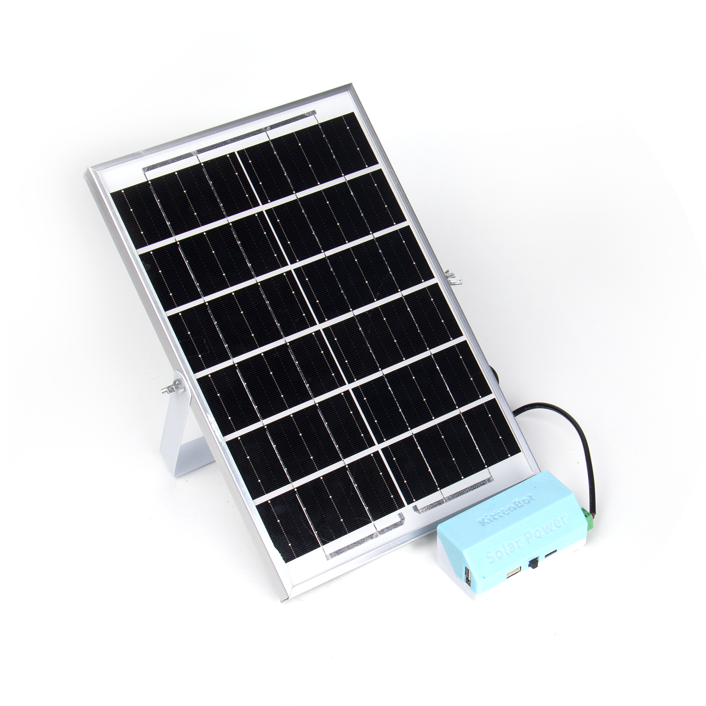
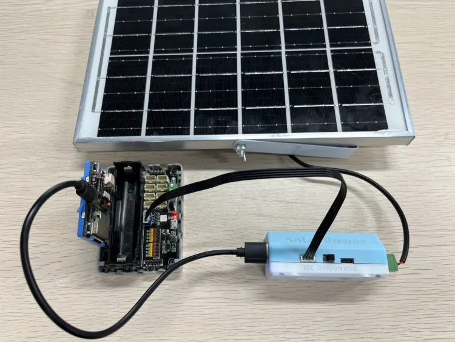
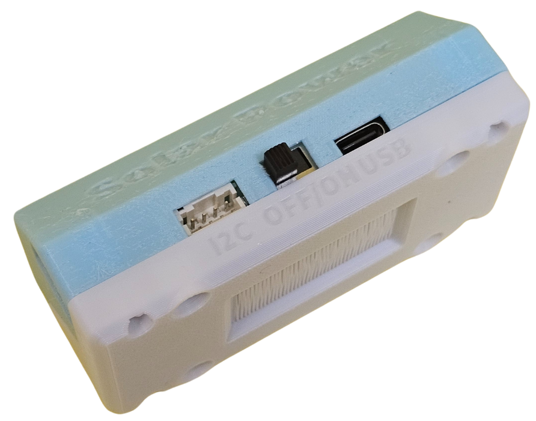
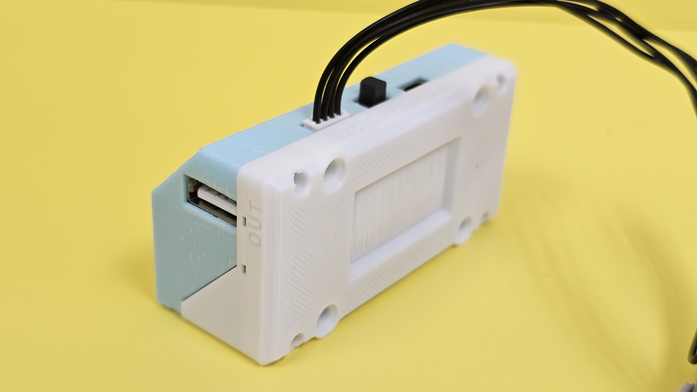
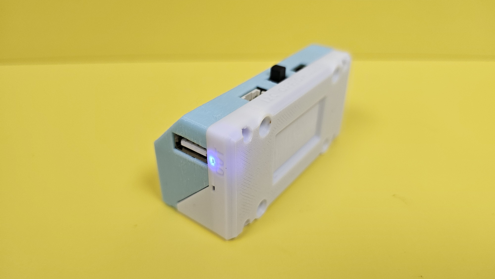

# Sugar二期 太陽能電源管理模組

<figure><figcaption></figcaption></figure>

太陽能電源管理模組是一個可以將太陽光轉換成為電力的模組，模組可以作為太陽能充電器，透過太陽能替模組的18650電池充電。更可以透過Micro:bit或未來板等主控板開啟或關閉太陽能板的輸出或休眠時間，模組亦搭載有實時時間模組，可以做到報時功能。

## 模組參數

* 太陽能板尺寸: 80 x 40 x 32.5 mm
* 重量: 646g(太陽能板+模組)
* 模組類型: I2C
* 太陽能板: 6V 6W 單晶硅

## 硬件接線

#### 參考接線


使用太陽能電源模組給Robotbit與未來板供電示範接線


<figure><figcaption></figcaption></figure>


請將電源開關撥到ON的位置


<figure><figcaption></figcaption></figure>

## 顯示燈詳解

#### 電源輸出顯示燈

開啟電源輸出時，輸出顯示燈會亮起藍燈。

<figure><figcaption></figcaption></figure>

 

<figure><figcaption></figcaption></figure>

#### 電源輸入顯示燈

當鋰電池正在充電時，電源輸入顯示燈會亮起紅燈。

<figure><figcaption></figcaption></figure>

## 參考程式

#### MakeCode編程教學

#### 加載Sugar插件：

#### 在擴展頁直接搜尋sugar (sugar已經過微軟認證，可以直接搜尋)

#### 你亦可以用插件地址搜尋

Sugar插件：https://github.com/KittenBot/pxt-sugar

#### [詳細方法](../../programmingplatforms/makecode/kittenbotandmakecode.md)

### 電源輸出控制



[參考程式](https://makecode.microbit.org/\_Mpk3PkF1YLVu)

### 電源輸出休眠



[參考程式](https://makecode.microbit.org/\_RYM4k5L1m7k3)

### 設定實時時鐘


注意：當太陽能模組的電源開關被關上或者電源輸出被關上時，實時時鐘的時間會被清除。




[參考程式](https://makecode.microbit.org/\_7i10L2HmyDzA)
