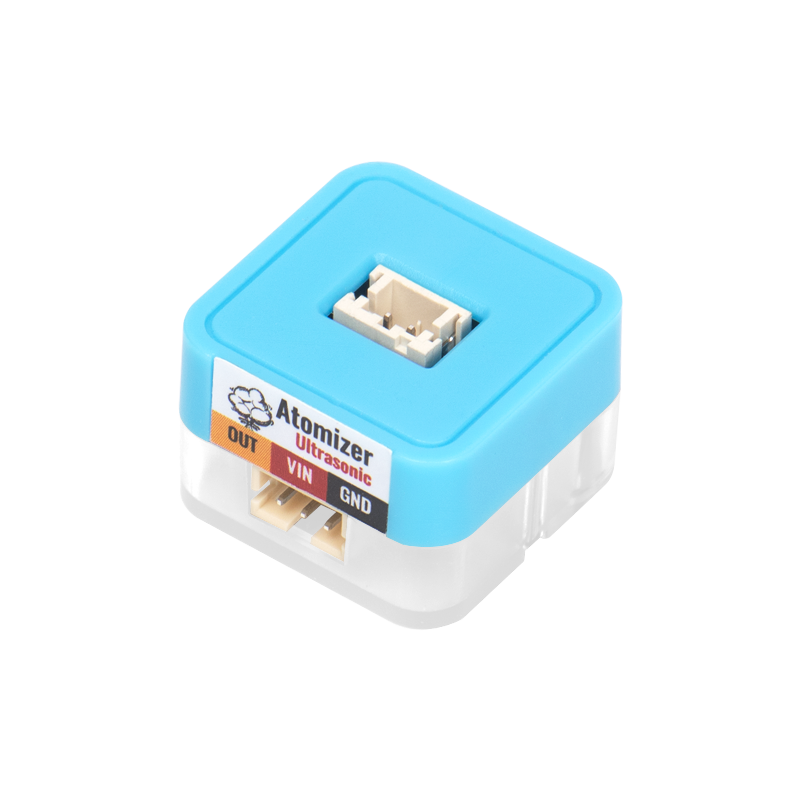

# Sugar二期 霧化器模組

這是一個霧化器，可以將水化成水霧揮發到環境當中。

### 產品參數

* 尺寸：24 x 24 x 23 mm

### 產品接線

用3Pin 連接線將模組與Robotbit Edu連接起來。

### 編程教學

#### MakeCode編程教學

#### 加載Sugar插件：

#### 在擴展頁直接搜尋sugar (sugar已經過微軟認證，可以直接搜尋)

#### 你亦可以用插件地址搜尋

Sugar插件：https://github.com/KittenBot/pxt-sugar

#### [詳細方法](../../programmingplatforms/makecode/kittenbotandmakecode.md)



[參考程式](https://makecode.microbit.org/\_gR56pF0aCEz1)
