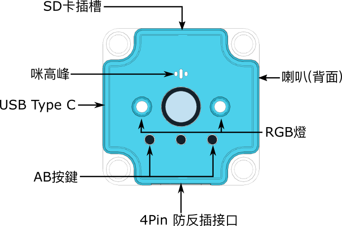
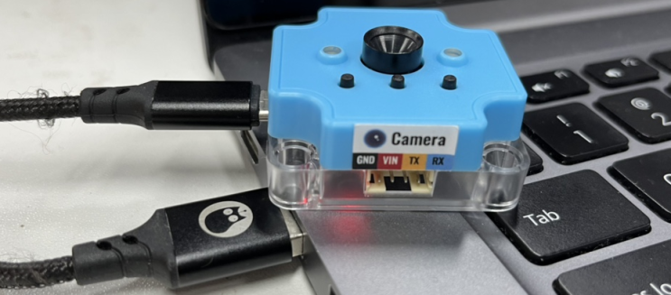
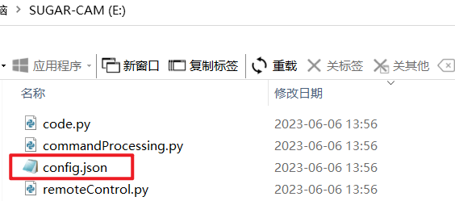
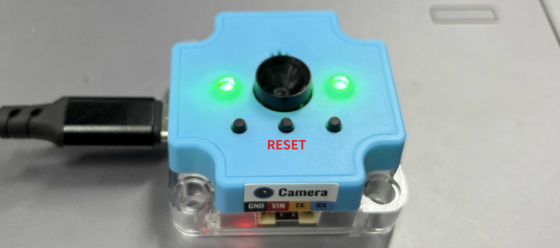

# Sugar二期 智能FPV鏡頭

<figure><figcaption></figcaption></figure>

這是一個具備WiFi功能的智能FPV鏡頭。模組主打具備IP Cam功能，可以透過WiFi實現圖傳。模組亦都具備拍照，二維碼掃描，錄音、播放和MQTT等功能。適合應用於遙距監控錄影、WiFi小車，掃碼等的應用場景中。

### 產品參數

* 主控芯片: ESP32-S3
* 工作電壓: 5V
* 工作電流: 500mA
* 像素: 200萬
* 接口: USB Type-C，4pin防反插
* 尺寸: 40x40x16mm
* 內置資源: 可編程按鍵\*2、RGB彩燈\*2、MEMS咪高峰、喇叭、MicroSD卡插槽
* 支援主控板: Micro:bit、未來板

### 產品詳細

<figure><figcaption></figcaption></figure>

### 功能一覽

* WiFi圖傳
  * KittenBlock、未來板、網頁顯示實時影像
* 人工智能現象辨識
  * 配合KittenBlock AI插件
* 二維碼掃描
* 拍照儲存
* 錄音播放
* 語音辨識
* 彩燈控制
* 按鍵編程
* 網頁遠端控制

### 使用教學

#### WiFi設定

收到模組的第一步就是設定模組的WiFi網絡。

首先使用USB Type C線將模組連接電腦。

<figure><figcaption></figcaption></figure>

在電腦上會出現一個名為Sugar-Cam的USB盤。打開裡面的config.json檔案。

```
用任何文字編輯器都可以打開。
```

<div>

<figure><figcaption></figcaption></figure>

 

<figure><figcaption></figcaption></figure>

</div>

將WiFi名稱和密碼輸入到ap和password裡面。

<figure><figcaption></figcaption></figure>

儲存後模組會重啟，當指示燈顯示綠色就代表成功連接網絡。

<figure><figcaption></figcaption></figure>

#### 模式切換

要切換模式的話，只要將config.json的model改為相應的模式就可以。

* 指令模式: commandProcessing
* 遙控模式: remoteControl

<div>

<figure><figcaption></figcaption></figure>

 

<figure><figcaption></figcaption></figure>

</div>

### 固件更新

Kittenbot會不時對模組進行更新，固件更新步驟如下。

下載固件更新檔案:



首先將模組用USB線連接到電腦。

<figure><figcaption></figcaption></figure>

將rar檔裡面的檔案全部複製到模組的USB盤上。

<figure><figcaption></figcaption></figure>
