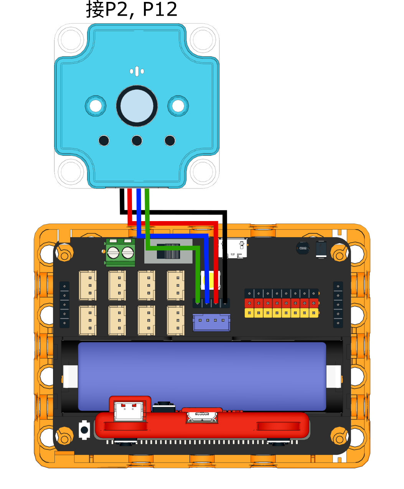

# Sugar Cam使用教學: 指令模式(預設)

智能FPV鏡頭的出廠就已經是設定為指令模式。主要的功能，包括WiFi圖傳，二維碼掃碼，拍照等都是在這個模式裡進行。

### 接線教學

<figure><figcaption></figcaption></figure>

### MakeCode編程教學

#### 加載Sugar插件：

#### 在擴展頁直接搜尋sugar (sugar已經過微軟認證，可以直接搜尋)

#### 你亦可以用插件地址搜尋

Sugar插件：https://github.com/KittenBot/pxt-sugar

#### [詳細方法](../../../../programmingplatforms/makecode/kittenbotandmakecode.md)

