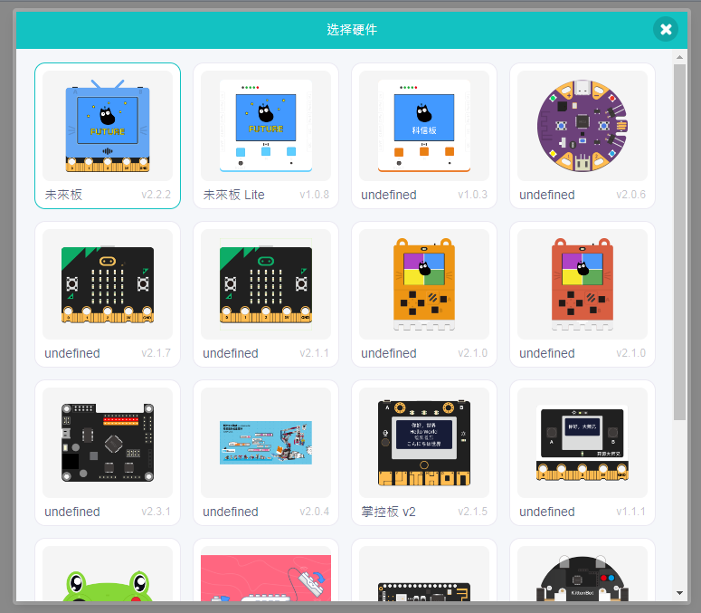

# Sugar Cam功能教學: 未來板圖傳

### 接線教學

<figure><figcaption></figcaption></figure>

### 未來板KittenBlock編程教學

打開網頁版Kittenblock，加載未來板硬件。

[https://kblock.kittenbot.cn/](https://kblock.kittenbot.cn/)

<figure><figcaption></figcaption></figure>

加載Sugar Cam插件。

<figure><figcaption></figcaption></figure>

 

<figure><figcaption></figcaption></figure>

<figure><figcaption></figcaption></figure>

### 未來板圖傳

編寫程式令未來板連上WiFi，並將Sugar Cam的IP和密鑰(在config.json中修改)填入以下程式。

<figure><figcaption></figcaption></figure>

 

<figure><figcaption></figcaption></figure>

### 參考程式



分別為未來板和Sugar Cam供電。

<figure><figcaption></figcaption></figure>

 

<figure><figcaption></figcaption></figure>

Sugar Cam的影像就會在未來板上顯示出來。

<figure><figcaption></figcaption></figure>

 

<figure><figcaption></figcaption></figure>

