# Sugar Cam功能示範: 未來板圖傳

### 接線教學

<figure><figcaption></figcaption></figure>

### 未來板KittenBlock編程教學

加載Sugar Cam插件。

<figure>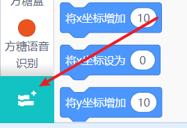<figcaption></figcaption></figure>

 

<figure>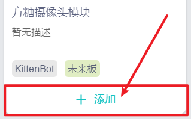<figcaption></figcaption></figure>

<figure>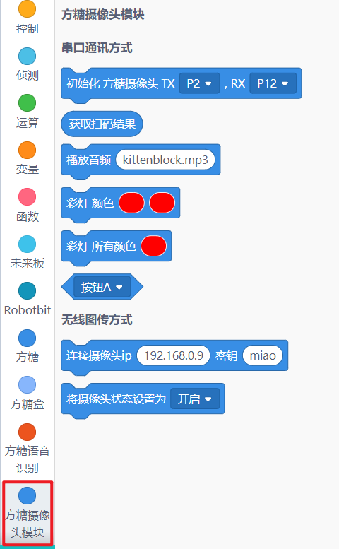<figcaption></figcaption></figure>

### 未來板圖傳

編寫程式令未來板連上WiFi，並將Sugar Cam的IP和密鑰(在config.json中修改)填入以下程式。

<figure><figcaption></figcaption></figure>

 

<figure>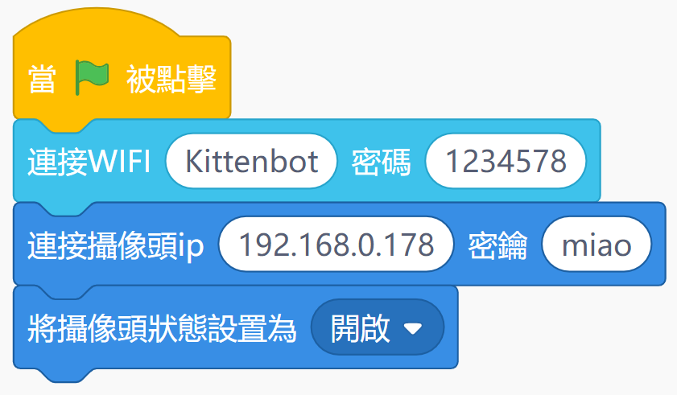<figcaption></figcaption></figure>

分別為未來板和Sugar Cam供電。

<figure>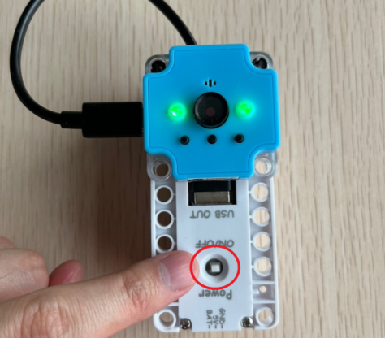<figcaption></figcaption></figure>

 

<figure>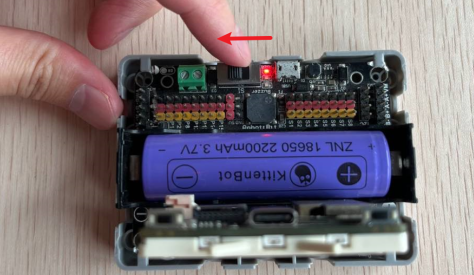<figcaption></figcaption></figure>

Sugar Cam的影像就會在未來板上顯示出來。

<figure><figcaption></figcaption></figure>

 

<figure>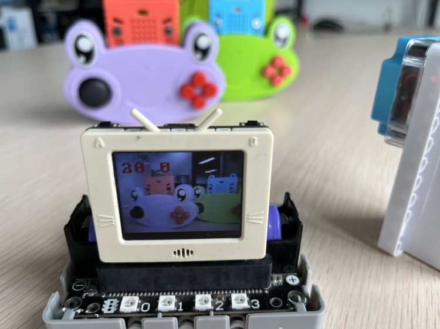<figcaption></figcaption></figure>

### 在Kittenblock中使用編程教學

首先在KittenBlock中加載Sugar Cam插件。

<figure>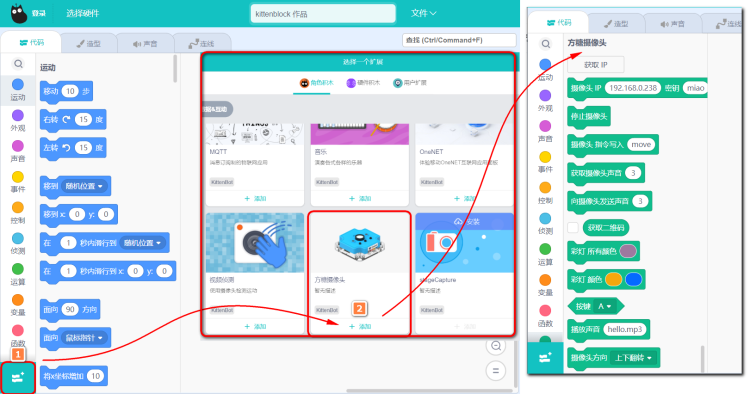<figcaption></figcaption></figure>

填入模組的IP地址，點擊積木，舞台就會出現模組畫面。

<figure>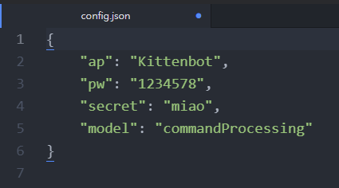<figcaption></figcaption></figure>

 

<figure>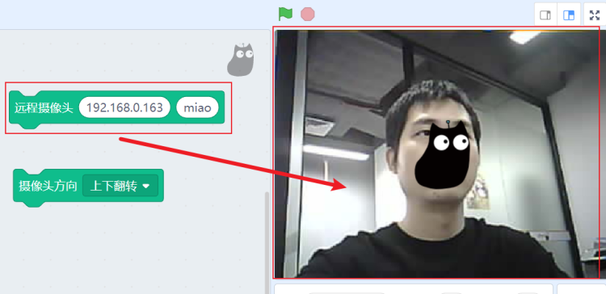<figcaption></figcaption></figure>

成功在Kittenblock顯示模組的畫面後就可以加載其他AI類插件使用。

有關KittenBlock內置AI插件的教學請參考以下篇章:


[extensions](../../../../ge-bian-cheng-ping-tai-jie-shao/kittenblock/features/extensions/)


<figure>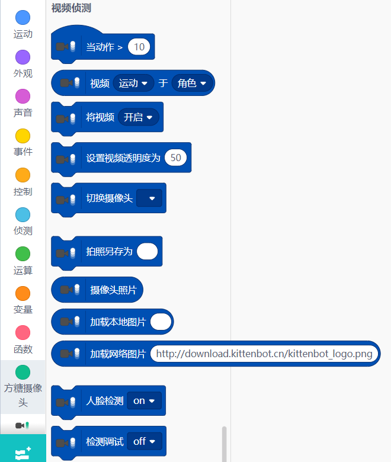<figcaption></figcaption></figure>

 

<figure>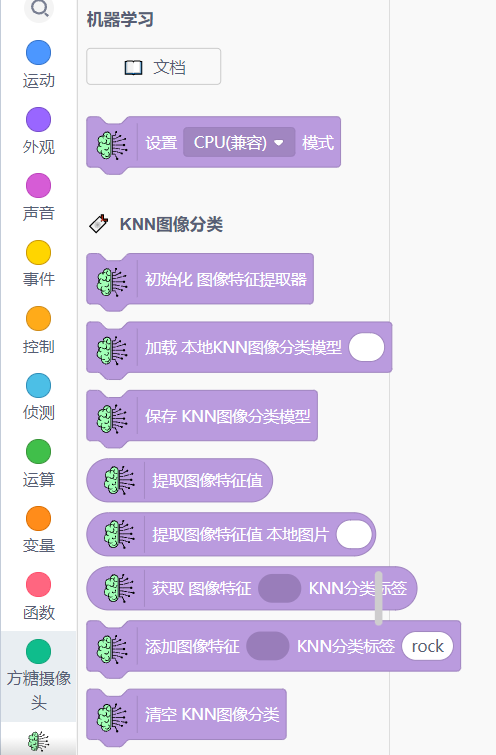<figcaption></figcaption></figure>

