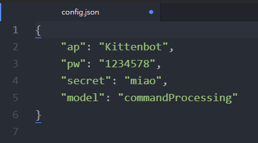

# Sugar Cam功能教學: KittenBlock編程

### 在Kittenblock中使用編程教學

首先在KittenBlock中加載Sugar Cam插件。

<figure><figcaption></figcaption></figure>

填入模組的IP地址，點擊積木，舞台就會出現模組畫面。

<figure><figcaption></figcaption></figure>

 

<figure><figcaption></figcaption></figure>

Sugar Cam插件裏已經有基本積木，可以做到掃描二維碼、發送錄音等功能。

<figure><figcaption></figcaption></figure>

### 錄音功能

透過Kittenblock編程，Sugar Cam可以做到收發錄音的功能。

<figure><figcaption></figcaption></figure>

按下發送聲音，KittenBlock就會錄音發送到Sugar Cam。

<figure><figcaption></figcaption></figure>

按下獲取聲音，Sugar Cam就會錄音發送到KittenBlock。

<figure><figcaption></figcaption></figure>
