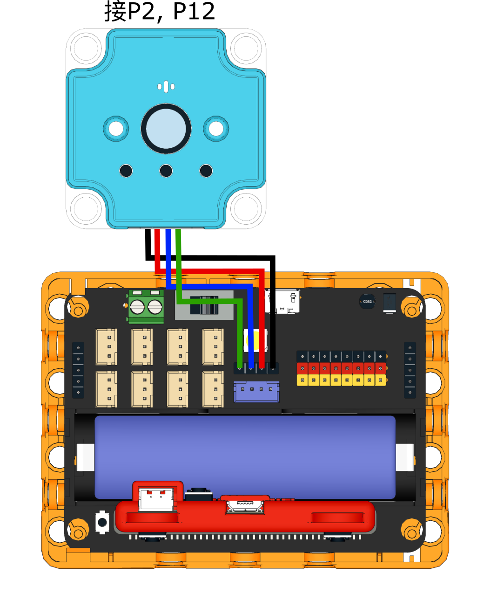

# Sugar Cam功能示範: 拍照與MP3播放

Sugar Cam可以播放MP3檔案和拍照儲存到SD卡。

### 接線教學

<figure><figcaption></figcaption></figure>

### MakeCode編程教學

#### 加載Sugar插件：

#### 在擴展頁直接搜尋sugar (sugar已經過微軟認證，可以直接搜尋)

#### 你亦可以用插件地址搜尋

Sugar插件：https://github.com/KittenBot/pxt-sugar

#### [詳細方法](../../../../ge-bian-cheng-ping-tai-jie-shao/makecode/kittenbotandmakecode.md)

### 拍照與播放mp3



[參考程式](https://makecode.microbit.org/\_THicH4AroPJc)
